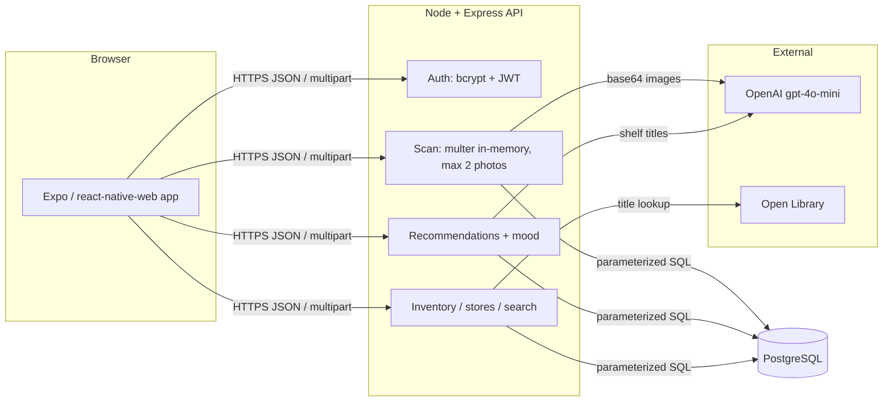

# ShelfScout — Project Overview

## What it is

A two-sided web app connecting readers and independent bookstores through one
interaction: photographing a shelf. Readers digitize their library and get AI
recommendations routed to real local inventory; bookstores get a near-zero-effort
way to publish what’s on their shelves.

## System architecture

**Flow (reader):** photo upload → multer holds it in RAM → gpt-4o-mini extracts
titles → user edits/confirms the list → titles enriched via Open Library →
saved to Postgres. The photo is never written to disk and is gone when the
request ends.

**Flow (business):** same extraction → diff preview (pg_trgm fuzzy match against
current inventory) → merge confirms only NEW titles; nothing is silently deleted.

**Recommendations:** the user’s saved titles (not images) go to the model, which
returns 8 recommendations + a reading-mood profile; each recommendation is
fuzzy-matched against all stores’ in-stock inventory to produce “Available at”
badges — the bridge between the B2C and B2B sides.

## Data model

| Table | Purpose |
|---|---|
| `users` | Readers and businesses in one table, `role` column; businesses add `store_name`, `store_location` |
| `books` | Canonical titles (`UNIQUE(title, author)`), Open Library cover/key |
| `scans` | Audit of every scan: who, kind (shelf/store), photo count (1–2) |
| `library_entries` | Reader ↔ book, deduped per user, linked to source scan |
| `inventory` | Business ↔ book with `in_stock` boolean |

## Security

| Threat | Mitigation |
|---|---|
| Credential theft | Passwords hashed with bcrypt (cost 12); never stored or logged in plaintext |
| Session forgery | JWTs pinned to HS256 at sign (`algorithm: 'HS256'`) and verify (`algorithms: ['HS256']`), 24h expiry; server refuses to boot without `JWT_SECRET` |
| Expired / revoked tokens | Client-side 401 auto-logout hook: any 401 response while a token is present clears AsyncStorage and fires `onUnauthorized`, returning the user to the login screen |
| User enumeration | Login returns the same generic 401 for unknown email and wrong password |
| Privilege escalation | `requireRole('business')` guards all inventory writes; every query scopes by the authenticated user id from the verified token, never from request input |
| scanId spoofing | `/library/confirm` validates that any supplied `scanId` belongs to the authenticated user before associating library entries; unowned or nonexistent ids are silently treated as null |
| Catalog pollution | `/inventory/confirm` fuzzy-matches incoming titles against the store’s existing stock (pg_trgm similarity > 0.6) and reuses the matched book row rather than creating a near-duplicate catalog entry |
| API key exposure | `OPENAI_API_KEY` lives only in server env; the browser never talks to OpenAI |
| SQL injection | 100% parameterized queries via `pg` ($1, $2…); no string-built SQL |
| Malicious uploads | Multer allowlist (JPEG/PNG/WebP only), 8MB size cap, hard 2-file cap, memory storage — uploads never touch the filesystem |
| Cost abuse / DoS | Rate limits: 300 req/15min global, 20/15min auth, 10/15min scans; 1MB JSON body cap; 2-photo cap bounds every OpenAI call; OpenAI client configured with 30s timeout and 1-retry cap |
| Open Library overload | `enrichAll` batches enrichment calls at 5 concurrent requests maximum |
| Data privacy | Photos discarded after extraction; only confirmed titles persist |
| Oversized/poisoned AI output | All model output sanitized: length-clamped strings, array caps, junk entries dropped; malformed JSON returns 502 |
| Accidental prod seed | Seed script exits with an error if `NODE_ENV=production` and `ALLOW_SEED` is not explicitly set to `'true'` |
| XSS / header attacks | helmet security headers; CORS locked to the app origin; React Native renders text, not HTML |
| Untrusted AI output as truth | Human-in-the-loop review screen before any AI result is persisted |

## AI design choices

- **gpt-4o-mini** for vision + recs: ~15–20x cheaper than gpt-4o, sufficient for
  spine OCR; model swappable via `OPENAI_MODEL` env var
- **Strict JSON mode** (`response_format: json_object`) with defensive parsing —
  malformed responses surface as 502 rather than silent data corruption
- **Human review before persistence** — the app treats model output as a draft
- **Cost ceiling by construction**: max 2 images per request, capped tokens
  (3000 extract / 2000 recs), rate-limited scan endpoint, 30s client timeout,
  1 retry cap, and 5-concurrent Open Library enrichment ceiling
- **Search** uses case-insensitive substring matching (`lower() LIKE`) combined
  with a pg_trgm fuzzy gate (`%` operator + similarity threshold) so both exact
  substrings and near-matches return results, ranked by similarity score

## Verification

- 55 supertest API tests covering auth, role guards, upload caps, ownership
  isolation, fuzzy matching, scanId validation (`server: npm test`)
- 6 RNTL component tests for the review/auth flows (`app: npm test`)
- `npm run check` syntax-checks every server file; `npx expo export --platform web`
  proves the web bundle builds
