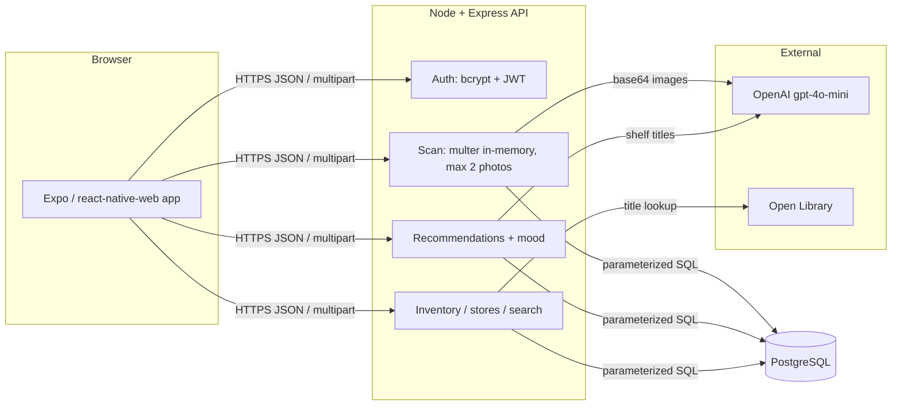

# ShelfScout Implementation Plan

> **For agentic workers:** REQUIRED SUB-SKILL: Use superpowers:subagent-driven-development (recommended) or superpowers:executing-plans to implement this plan task-by-task. Steps use checkbox (`- [ ]`) syntax for tracking.

**Goal:** Web app where readers photograph a bookshelf to get their library digitized, receive AI book recommendations + a reading-mood profile, and where bookstores photograph shelves to update a public inventory readers can browse and search.

**Architecture:** Two-package monorepo. `server/` is Node/Express + local Postgres holding all secrets (OpenAI key never reaches the browser); photos are processed in memory via gpt-4o-mini vision and discarded. `app/` is an Expo + react-native-web JS app (web-only target) with a lightweight state router. Detected titles always pass through an editable review screen before persisting. Recommendations are LLM-generated then fuzzy-matched (pg_trgm) against business inventories for "available at" badges.

**Tech Stack:** Express, pg, bcryptjs, jsonwebtoken, multer (memory storage), helmet, cors, express-rate-limit, openai (gpt-4o-mini), Open Library API; Expo (react-native-web, JS only), expo-image-picker, AsyncStorage; jest + supertest (server), jest-expo + @testing-library/react-native v13 (app).

**Decisions locked (from grill-me interview):**
- Expo + react-native-web, plain JS, web target only
- Node/Express + local Postgres (`shelfscout` / `shelfscout_test` databases)
- gpt-4o-mini, model overridable via `OPENAI_MODEL` env var
- Max **2 photos per scan**, enforced client-side (`selectionLimit: 2`) AND server-side (multer `files: 2`)
- Photos discarded after extraction (memory storage, never written to disk)
- Single `users` table with `role` = `reader | business`
- Editable review list before any save (reader library AND business inventory)
- Recs = LLM + inventory fuzzy match; mood = reading-personality profile
- Inventory: merge with diff preview, presence-only stock (boolean)
- Extras: public store pages, cross-store search, scan history / personal library
- Open Library enrichment (covers/authors), graceful fallback
- Seed script with demo accounts
- Docs: README.md + PROJECT_OVERVIEW.md (security section + mermaid diagram)
- When building Tasks 11–15 UI, invoke the Anthropic `frontend-design` skill if installed; the code below is the functional baseline.

---

## File Structure

```
shelfscout/
├── server/
│   ├── package.json
│   ├── .env.example
│   ├── sql/schema.sql              # tables + pg_trgm + indexes
│   ├── scripts/db-init.js          # applies schema.sql to DATABASE_URL
│   ├── scripts/seed.js             # demo reader + 2 bookstores + inventory
│   ├── src/
│   │   ├── config.js               # env, fails fast on missing JWT secret
│   │   ├── db.js                   # pg pool + query helper
│   │   ├── app.js                  # express app (no listen) — supertest imports this
│   │   ├── index.js                # listen()
│   │   ├── middleware/auth.js      # requireAuth (JWT), requireRole
│   │   ├── services/vision.js      # extractTitles, getRecommendationsAndMood (OpenAI)
│   │   ├── services/openlibrary.js # enrichBook (covers/authors)
│   │   ├── services/books.js       # sanitizeBooks, upsertBook
│   │   └── routes/                 # auth, scan, library, recommendations, inventory, stores, search
│   └── tests/                      # helpers.js + one test file per route
├── app/
│   ├── App.js                      # state router + role-aware tab bar
│   ├── src/
│   │   ├── theme.js                # bookstore palette + fonts
│   │   ├── api.js                  # fetch wrapper, token storage
│   │   ├── components/UI.js        # Button, Field, Chip, BookRow, ErrorText
│   │   └── screens/                # Auth, Scan, Review, Library, Recommendations, Inventory, Stores, StoreDetail
│   └── __tests__/                  # ReviewScreen, AuthScreen RNTL tests
├── README.md
└── PROJECT_OVERVIEW.md
```

---

### Task 1: Repo scaffold, server package, database schema

**Files:**
- Create: `.gitignore`, `server/package.json`, `server/.env.example`, `server/sql/schema.sql`, `server/scripts/db-init.js`, `server/src/config.js`, `server/src/db.js`

- [ ] **Step 1: Init repo and server package**

```bash
cd /Users/ilaakshmishra/Documents/shelfscout
git init
mkdir -p server/src/{middleware,services,routes} server/sql server/scripts server/tests
cd server && npm init -y
npm install express pg bcryptjs jsonwebtoken multer helmet cors express-rate-limit openai dotenv
npm install --save-dev jest supertest nodemon
```

- [ ] **Step 2: Write `.gitignore`** (repo root)

```
node_modules/
.env
.expo/
dist/
web-build/
*.log
```

- [ ] **Step 3: Set server scripts** — edit `server/package.json` `"scripts"`:

```json
{
  "scripts": {
    "start": "node src/index.js",
    "dev": "nodemon src/index.js",
    "db:init": "node scripts/db-init.js",
    "db:init:test": "NODE_ENV=test node scripts/db-init.js",
    "seed": "node scripts/seed.js",
    "test": "jest --runInBand",
    "check": "find src scripts -name '*.js' -exec node --check {} +"
  },
  "jest": { "testEnvironment": "node" }
}
```

(`--runInBand` because all test files share one Postgres test database.)

- [ ] **Step 4: Write `server/.env.example`**

```
DATABASE_URL=postgresql://localhost:5432/shelfscout
TEST_DATABASE_URL=postgresql://localhost:5432/shelfscout_test
JWT_SECRET=change-me-to-a-long-random-string
OPENAI_API_KEY=sk-...
OPENAI_MODEL=gpt-4o-mini
PORT=4000
CORS_ORIGIN=http://localhost:8081
```

- [ ] **Step 5: Write `server/sql/schema.sql`**

```sql
CREATE EXTENSION IF NOT EXISTS pg_trgm;

CREATE TABLE IF NOT EXISTS users (
  id SERIAL PRIMARY KEY,
  email TEXT UNIQUE NOT NULL,
  password_hash TEXT NOT NULL,
  role TEXT NOT NULL CHECK (role IN ('reader', 'business')),
  store_name TEXT,
  store_location TEXT,
  created_at TIMESTAMPTZ NOT NULL DEFAULT now()
);

CREATE TABLE IF NOT EXISTS books (
  id SERIAL PRIMARY KEY,
  title TEXT NOT NULL,
  author TEXT NOT NULL DEFAULT '',
  cover_url TEXT,
  openlibrary_key TEXT,
  UNIQUE (title, author)
);

CREATE TABLE IF NOT EXISTS scans (
  id SERIAL PRIMARY KEY,
  user_id INT NOT NULL REFERENCES users(id) ON DELETE CASCADE,
  kind TEXT NOT NULL CHECK (kind IN ('shelf', 'store')),
  photo_count INT NOT NULL CHECK (photo_count BETWEEN 1 AND 2),
  created_at TIMESTAMPTZ NOT NULL DEFAULT now()
);

CREATE TABLE IF NOT EXISTS library_entries (
  id SERIAL PRIMARY KEY,
  user_id INT NOT NULL REFERENCES users(id) ON DELETE CASCADE,
  book_id INT NOT NULL REFERENCES books(id) ON DELETE CASCADE,
  scan_id INT REFERENCES scans(id) ON DELETE SET NULL,
  added_at TIMESTAMPTZ NOT NULL DEFAULT now(),
  UNIQUE (user_id, book_id)
);

CREATE TABLE IF NOT EXISTS inventory (
  id SERIAL PRIMARY KEY,
  business_id INT NOT NULL REFERENCES users(id) ON DELETE CASCADE,
  book_id INT NOT NULL REFERENCES books(id) ON DELETE CASCADE,
  in_stock BOOLEAN NOT NULL DEFAULT true,
  updated_at TIMESTAMPTZ NOT NULL DEFAULT now(),
  UNIQUE (business_id, book_id)
);

CREATE INDEX IF NOT EXISTS idx_books_title_trgm ON books USING gin (lower(title) gin_trgm_ops);
CREATE INDEX IF NOT EXISTS idx_inventory_business ON inventory (business_id);
CREATE INDEX IF NOT EXISTS idx_library_user ON library_entries (user_id);
```

Note: `author` is `NOT NULL DEFAULT ''` (not nullable) so `UNIQUE (title, author)` dedupes correctly — Postgres treats NULLs as distinct in unique constraints. Code always passes `''` for unknown author.

- [ ] **Step 6: Write `server/src/config.js`**

```js
require('dotenv').config();

const isTest = process.env.NODE_ENV === 'test';

const config = {
  isTest,
  port: process.env.PORT || 4000,
  databaseUrl: isTest
    ? process.env.TEST_DATABASE_URL || 'postgresql://localhost:5432/shelfscout_test'
    : process.env.DATABASE_URL || 'postgresql://localhost:5432/shelfscout',
  jwtSecret: process.env.JWT_SECRET || (isTest ? 'test-secret' : null),
  corsOrigin: process.env.CORS_ORIGIN || 'http://localhost:8081',
  openaiKey: process.env.OPENAI_API_KEY,
  openaiModel: process.env.OPENAI_MODEL || 'gpt-4o-mini',
};

if (!config.jwtSecret) {
  throw new Error('JWT_SECRET environment variable is required');
}

module.exports = config;
```

- [ ] **Step 7: Write `server/src/db.js`**

```js
const { Pool } = require('pg');
const config = require('./config');

const pool = new Pool({ connectionString: config.databaseUrl });

module.exports = {
  pool,
  query: (text, params) => pool.query(text, params),
};
```

- [ ] **Step 8: Write `server/scripts/db-init.js`**

```js
const fs = require('fs');
const path = require('path');
const { pool } = require('../src/db');

(async () => {
  const sql = fs.readFileSync(path.join(__dirname, '..', 'sql', 'schema.sql'), 'utf8');
  await pool.query(sql);
  console.log('Schema applied to', process.env.NODE_ENV === 'test' ? 'test DB' : 'dev DB');
  await pool.end();
})().catch((err) => { console.error(err); process.exit(1); });
```

- [ ] **Step 9: Create databases and apply schema**

```bash
createdb shelfscout 2>/dev/null; createdb shelfscout_test 2>/dev/null
cp .env.example .env   # then fill JWT_SECRET + OPENAI_API_KEY
npm run db:init && npm run db:init:test
```

Expected: `Schema applied to dev DB` and `Schema applied to test DB`. If `createdb` is missing, Postgres isn't installed — `brew install postgresql@16 && brew services start postgresql@16` first.

- [ ] **Step 10: Commit**

```bash
git add -A && git commit -m "chore: scaffold server package, schema, db config"
```

---

### Task 2: Express app skeleton + health check

**Files:**
- Create: `server/src/app.js`, `server/src/index.js`, `server/tests/health.test.js`

- [ ] **Step 1: Write failing test `server/tests/health.test.js`**

```js
const request = require('supertest');
const app = require('../src/app');
const { pool } = require('../src/db');

afterAll(() => pool.end());

test('GET /api/health returns ok', async () => {
  const res = await request(app).get('/api/health');
  expect(res.status).toBe(200);
  expect(res.body).toEqual({ ok: true });
});

test('unknown route returns JSON 404', async () => {
  const res = await request(app).get('/api/nope');
  expect(res.status).toBe(404);
  expect(res.body.error).toBe('Not found');
});
```

- [ ] **Step 2: Run to verify failure** — `npm test` → FAIL `Cannot find module '../src/app'`

- [ ] **Step 3: Write `server/src/app.js`**

```js
const express = require('express');
const helmet = require('helmet');
const cors = require('cors');
const rateLimit = require('express-rate-limit');
const config = require('./config');

const app = express();
app.use(helmet());
app.use(cors({ origin: config.corsOrigin }));
app.use(express.json({ limit: '1mb' }));

const skipInTest = { skip: () => config.isTest, standardHeaders: true, legacyHeaders: false };
const globalLimiter = rateLimit({ windowMs: 15 * 60 * 1000, max: 300, ...skipInTest });
const authLimiter = rateLimit({ windowMs: 15 * 60 * 1000, max: 20, ...skipInTest });
app.use(globalLimiter);

app.get('/api/health', (req, res) => res.json({ ok: true }));

// Routes mounted in later tasks:
// app.use('/api/auth', authLimiter, require('./routes/auth'));
// app.use('/api/scan', require('./routes/scan'));
// app.use('/api/library', require('./routes/library'));
// app.use('/api/recommendations', require('./routes/recommendations'));
// app.use('/api/inventory', require('./routes/inventory'));
// app.use('/api/stores', require('./routes/stores'));
// app.use('/api/search', require('./routes/search'));

app.use((req, res) => res.status(404).json({ error: 'Not found' }));
app.use((err, req, res, _next) => {
  console.error(err);
  res.status(500).json({ error: 'Internal server error' });
});

module.exports = app;
module.exports.authLimiter = authLimiter;
```

- [ ] **Step 4: Write `server/src/index.js`**

```js
const app = require('./app');
const config = require('./config');

app.listen(config.port, () => {
  console.log(`ShelfScout API listening on http://localhost:${config.port}`);
});
```

- [ ] **Step 5: Run tests** — `npm test` → 2 passing.

- [ ] **Step 6: Commit** — `git add -A && git commit -m "feat: express app skeleton with helmet, cors, rate limiting"`

---

### Task 3: Auth — register, login, JWT middleware, role guard

**Files:**
- Create: `server/src/routes/auth.js`, `server/src/middleware/auth.js`, `server/tests/helpers.js`, `server/tests/auth.test.js`
- Modify: `server/src/app.js` (uncomment auth mount)

- [ ] **Step 1: Write `server/tests/helpers.js`**

```js
const request = require('supertest');
const app = require('../src/app');
const { pool, query } = require('../src/db');

async function resetDb() {
  await query('TRUNCATE users, books, scans, library_entries, inventory RESTART IDENTITY CASCADE');
}

let counter = 0;
async function register(overrides = {}) {
  counter += 1;
  const body = {
    email: `user${counter}-${Date.now()}@test.com`,
    password: 'password123',
    role: 'reader',
    ...overrides,
  };
  const res = await request(app).post('/api/auth/register').send(body);
  if (res.status !== 201) throw new Error(`register helper failed: ${JSON.stringify(res.body)}`);
  return { token: res.body.token, user: res.body.user };
}

const registerBusiness = (overrides = {}) =>
  register({ role: 'business', storeName: 'Test Books', ...overrides });

// 1x1 transparent PNG for upload tests
const TINY_PNG = Buffer.from(
  'iVBORw0KGgoAAAANSUhEUgAAAAEAAAABCAYAAAAfFcSJAAAADUlEQVR42mNk+M9QDwADhgGAWjR9awAAAABJRU5ErkJggg==',
  'base64'
);

module.exports = { app, pool, query, resetDb, register, registerBusiness, TINY_PNG };
```

- [ ] **Step 2: Write failing tests `server/tests/auth.test.js`**

```js
const request = require('supertest');
const { app, pool, resetDb, register, registerBusiness } = require('./helpers');

beforeEach(resetDb);
afterAll(() => pool.end());

describe('POST /api/auth/register', () => {
  test('registers a reader and returns token', async () => {
    const res = await request(app).post('/api/auth/register')
      .send({ email: 'a@b.com', password: 'password123', role: 'reader' });
    expect(res.status).toBe(201);
    expect(res.body.token).toBeTruthy();
    expect(res.body.user).toMatchObject({ email: 'a@b.com', role: 'reader' });
    expect(res.body.user.password_hash).toBeUndefined();
  });

  test('rejects short password', async () => {
    const res = await request(app).post('/api/auth/register')
      .send({ email: 'a@b.com', password: 'short', role: 'reader' });
    expect(res.status).toBe(400);
  });

  test('rejects invalid email and invalid role', async () => {
    expect((await request(app).post('/api/auth/register')
      .send({ email: 'nope', password: 'password123', role: 'reader' })).status).toBe(400);
    expect((await request(app).post('/api/auth/register')
      .send({ email: 'a@b.com', password: 'password123', role: 'admin' })).status).toBe(400);
  });

  test('business requires storeName', async () => {
    const res = await request(app).post('/api/auth/register')
      .send({ email: 'shop@b.com', password: 'password123', role: 'business' });
    expect(res.status).toBe(400);
  });

  test('duplicate email returns 409', async () => {
    await register({ email: 'dup@b.com' });
    const res = await request(app).post('/api/auth/register')
      .send({ email: 'dup@b.com', password: 'password123', role: 'reader' });
    expect(res.status).toBe(409);
  });
});

describe('POST /api/auth/login', () => {
  test('valid credentials return token', async () => {
    await register({ email: 'me@b.com', password: 'password123' });
    const res = await request(app).post('/api/auth/login')
      .send({ email: 'me@b.com', password: 'password123' });
    expect(res.status).toBe(200);
    expect(res.body.token).toBeTruthy();
  });

  test('wrong password returns 401 with generic message', async () => {
    await register({ email: 'me@b.com', password: 'password123' });
    const res = await request(app).post('/api/auth/login')
      .send({ email: 'me@b.com', password: 'wrong-pass' });
    expect(res.status).toBe(401);
    expect(res.body.error).toBe('Invalid email or password');
  });

  test('unknown email returns same 401 (no user enumeration)', async () => {
    const res = await request(app).post('/api/auth/login')
      .send({ email: 'ghost@b.com', password: 'password123' });
    expect(res.status).toBe(401);
    expect(res.body.error).toBe('Invalid email or password');
  });
});
```

- [ ] **Step 3: Run to verify failure** — `npm test tests/auth.test.js` → FAIL (404s, register helper throws).

- [ ] **Step 4: Write `server/src/middleware/auth.js`**

```js
const jwt = require('jsonwebtoken');
const config = require('../config');

function requireAuth(req, res, next) {
  const header = req.headers.authorization || '';
  const token = header.startsWith('Bearer ') ? header.slice(7) : null;
  if (!token) return res.status(401).json({ error: 'Authentication required' });
  try {
    const payload = jwt.verify(token, config.jwtSecret);
    req.user = { id: payload.sub, role: payload.role };
    return next();
  } catch {
    return res.status(401).json({ error: 'Invalid or expired token' });
  }
}

function requireRole(role) {
  return (req, res, next) => {
    if (req.user.role !== role) {
      return res.status(403).json({ error: `${role} account required` });
    }
    return next();
  };
}

module.exports = { requireAuth, requireRole };
```

- [ ] **Step 5: Write `server/src/routes/auth.js`**

```js
const router = require('express').Router();
const bcrypt = require('bcryptjs');
const jwt = require('jsonwebtoken');
const { query } = require('../db');
const config = require('../config');

const EMAIL_RE = /^[^\s@]+@[^\s@]+\.[^\s@]+$/;

const sign = (user) =>
  jwt.sign({ sub: user.id, role: user.role }, config.jwtSecret, { expiresIn: '24h' });

const publicUser = (u) => ({
  id: u.id, email: u.email, role: u.role,
  store_name: u.store_name, store_location: u.store_location,
});

router.post('/register', async (req, res, next) => {
  try {
    const { email, password, role, storeName, storeLocation } = req.body || {};
    if (!EMAIL_RE.test(email || '')) return res.status(400).json({ error: 'Valid email required' });
    if (typeof password !== 'string' || password.length < 8) {
      return res.status(400).json({ error: 'Password must be at least 8 characters' });
    }
    if (!['reader', 'business'].includes(role)) {
      return res.status(400).json({ error: 'Role must be reader or business' });
    }
    if (role === 'business' && !String(storeName || '').trim()) {
      return res.status(400).json({ error: 'Store name required for business accounts' });
    }
    const hash = await bcrypt.hash(password, 12);
    const { rows } = await query(
      `INSERT INTO users (email, password_hash, role, store_name, store_location)
       VALUES ($1, $2, $3, $4, $5)
       ON CONFLICT (email) DO NOTHING
       RETURNING id, email, role, store_name, store_location`,
      [email.toLowerCase(), hash, role,
       role === 'business' ? String(storeName).trim().slice(0, 120) : null,
       role === 'business' && storeLocation ? String(storeLocation).trim().slice(0, 200) : null]
    );
    if (!rows[0]) return res.status(409).json({ error: 'Email already registered' });
    return res.status(201).json({ token: sign(rows[0]), user: publicUser(rows[0]) });
  } catch (err) { return next(err); }
});

router.post('/login', async (req, res, next) => {
  try {
    const { email, password } = req.body || {};
    const { rows } = await query('SELECT * FROM users WHERE email = $1', [String(email || '').toLowerCase()]);
    const user = rows[0];
    const ok = user && (await bcrypt.compare(String(password || ''), user.password_hash));
    if (!ok) return res.status(401).json({ error: 'Invalid email or password' });
    return res.json({ token: sign(user), user: publicUser(user) });
  } catch (err) { return next(err); }
});

module.exports = router;
```

- [ ] **Step 6: Mount in `server/src/app.js`** — replace the commented auth line with:

```js
app.use('/api/auth', authLimiter, require('./routes/auth'));
```

(keep it above the 404 handler, where the comment block sits).

- [ ] **Step 7: Run tests** — `npm test` → all passing.

- [ ] **Step 8: Commit** — `git add -A && git commit -m "feat: auth with bcrypt, JWT, role guard"`

---

### Task 4: Vision service (OpenAI gpt-4o-mini)

**Files:**
- Create: `server/src/services/vision.js`, `server/tests/vision.test.js`

- [ ] **Step 1: Write failing test `server/tests/vision.test.js`** (mocks the OpenAI SDK — no network, no key)

```js
jest.mock('openai', () => {
  const create = jest.fn();
  const MockOpenAI = jest.fn(() => ({ chat: { completions: { create } } }));
  MockOpenAI.__create = create;
  return MockOpenAI;
});
const OpenAI = require('openai');
const { extractTitles, getRecommendationsAndMood } = require('../src/services/vision');

const reply = (obj) => ({ choices: [{ message: { content: JSON.stringify(obj) } }] });

test('extractTitles parses, trims, and drops junk entries', async () => {
  OpenAI.__create.mockResolvedValueOnce(reply({
    books: [
      { title: '  Dune ', author: 'Frank Herbert' },
      { title: '', author: 'x' },
      { title: 'Untitled Memoir' },
      null,
    ],
  }));
  const out = await extractTitles([{ mimetype: 'image/png', buffer: Buffer.from('x') }]);
  expect(out).toEqual([
    { title: 'Dune', author: 'Frank Herbert' },
    { title: 'Untitled Memoir', author: '' },
  ]);
  const call = OpenAI.__create.mock.calls[0][0];
  expect(call.response_format).toEqual({ type: 'json_object' });
  expect(call.messages[0].content.filter((c) => c.type === 'image_url')).toHaveLength(1);
});

test('getRecommendationsAndMood returns recs and mood', async () => {
  OpenAI.__create.mockResolvedValueOnce(reply({
    recommendations: [{ title: 'Hyperion', author: 'Dan Simmons', reason: 'Epic sci-fi like Dune' }],
    mood: { profileName: 'Cosmic Wanderer', summary: 'Drawn to vast worlds.', tags: ['epic', 'curious'] },
  }));
  const out = await getRecommendationsAndMood([{ title: 'Dune', author: 'Frank Herbert' }]);
  expect(out.recommendations[0].title).toBe('Hyperion');
  expect(out.mood.profileName).toBe('Cosmic Wanderer');
});
```

- [ ] **Step 2: Run to verify failure** — `npm test tests/vision.test.js` → FAIL `Cannot find module '../src/services/vision'`

- [ ] **Step 3: Write `server/src/services/vision.js`**

```js
const OpenAI = require('openai');
const config = require('../config');

let client;
const getClient = () => {
  if (!client) client = new OpenAI({ apiKey: config.openaiKey });
  return client;
};

const cleanBooks = (list) =>
  (Array.isArray(list) ? list : [])
    .filter((b) => b && typeof b.title === 'string' && b.title.trim())
    .map((b) => ({
      title: b.title.trim().slice(0, 300),
      author: typeof b.author === 'string' ? b.author.trim().slice(0, 200) : '',
    }));

const EXTRACT_PROMPT =
  'These photos show book spines on a shelf. Identify every book whose title you can ' +
  'actually read. Do not guess unreadable spines. Return JSON exactly as ' +
  '{"books":[{"title":"...","author":"..."}]} — author empty string if not visible.';

async function extractTitles(files) {
  const content = [
    { type: 'text', text: EXTRACT_PROMPT },
    ...files.map((f) => ({
      type: 'image_url',
      image_url: { url: `data:${f.mimetype};base64,${f.buffer.toString('base64')}` },
    })),
  ];
  const res = await getClient().chat.completions.create({
    model: config.openaiModel,
    messages: [{ role: 'user', content }],
    response_format: { type: 'json_object' },
    max_tokens: 3000,
  });
  return cleanBooks(JSON.parse(res.choices[0].message.content).books);
}

async function getRecommendationsAndMood(libraryBooks) {
  const shelf = libraryBooks
    .map((b) => (b.author ? `${b.title} — ${b.author}` : b.title))
    .join('\n');
  const prompt =
    `A reader's bookshelf:\n${shelf}\n\n` +
    'Return JSON exactly as {"recommendations":[{"title":"...","author":"...","reason":"one sentence"}],' +
    '"mood":{"profileName":"two-word reading persona","summary":"2-3 sentence personality read of this shelf",' +
    '"tags":["mood word", "..."]}} with 8 recommendations of real books NOT on the shelf and 4-6 mood tags.';
  const res = await getClient().chat.completions.create({
    model: config.openaiModel,
    messages: [{ role: 'user', content: prompt }],
    response_format: { type: 'json_object' },
    max_tokens: 2000,
  });
  const parsed = JSON.parse(res.choices[0].message.content);
  return {
    recommendations: cleanBooks(parsed.recommendations).map((b, i) => ({
      ...b,
      reason: String(parsed.recommendations?.[i]?.reason || '').slice(0, 400),
    })),
    mood: {
      profileName: String(parsed.mood?.profileName || 'Eclectic Reader').slice(0, 80),
      summary: String(parsed.mood?.summary || '').slice(0, 600),
      tags: (Array.isArray(parsed.mood?.tags) ? parsed.mood.tags : [])
        .slice(0, 6).map((t) => String(t).slice(0, 30)),
    },
  };
}

module.exports = { extractTitles, getRecommendationsAndMood };
```

- [ ] **Step 4: Run tests** — `npm test tests/vision.test.js` → 2 passing.

- [ ] **Step 5: Commit** — `git add -A && git commit -m "feat: openai vision service for title extraction, recs, mood"`

---

### Task 5: Scan endpoint — 2-photo cap, validation, in-memory processing

**Files:**
- Create: `server/src/routes/scan.js`, `server/tests/scan.test.js`
- Modify: `server/src/app.js` (mount scan route)

- [ ] **Step 1: Write failing tests `server/tests/scan.test.js`**

```js
jest.mock('../src/services/vision', () => ({
  extractTitles: jest.fn(async () => [{ title: 'Dune', author: 'Frank Herbert' }]),
}));
const request = require('supertest');
const { app, pool, query, resetDb, register, TINY_PNG } = require('./helpers');
const { extractTitles } = require('../src/services/vision');

beforeEach(async () => { await resetDb(); extractTitles.mockClear(); });
afterAll(() => pool.end());

test('rejects unauthenticated scan', async () => {
  const res = await request(app).post('/api/scan').attach('photos', TINY_PNG, 'shelf.png');
  expect(res.status).toBe(401);
});

test('accepts 1-2 photos, returns books, records scan, keeps no files', async () => {
  const { token } = await register();
  const res = await request(app).post('/api/scan')
    .set('Authorization', `Bearer ${token}`)
    .attach('photos', TINY_PNG, 'a.png')
    .attach('photos', TINY_PNG, 'b.png');
  expect(res.status).toBe(200);
  expect(res.body.books).toEqual([{ title: 'Dune', author: 'Frank Herbert' }]);
  expect(res.body.scanId).toBeTruthy();
  const { rows } = await query('SELECT * FROM scans');
  expect(rows).toHaveLength(1);
  expect(rows[0]).toMatchObject({ kind: 'shelf', photo_count: 2 });
});

test('rejects 3 photos with clear error', async () => {
  const { token } = await register();
  const res = await request(app).post('/api/scan')
    .set('Authorization', `Bearer ${token}`)
    .attach('photos', TINY_PNG, 'a.png')
    .attach('photos', TINY_PNG, 'b.png')
    .attach('photos', TINY_PNG, 'c.png');
  expect(res.status).toBe(400);
  expect(res.body.error).toBe('Maximum 2 photos per scan');
});

test('rejects zero photos and non-image files', async () => {
  const { token } = await register();
  expect((await request(app).post('/api/scan')
    .set('Authorization', `Bearer ${token}`)).status).toBe(400);
  const res = await request(app).post('/api/scan')
    .set('Authorization', `Bearer ${token}`)
    .attach('photos', Buffer.from('not an image'), { filename: 'x.txt', contentType: 'text/plain' });
  expect(res.status).toBe(400);
  expect(res.body.error).toBe('Only JPEG, PNG or WebP images are accepted');
});

test('business with ?kind=store records store scan', async () => {
  const { registerBusiness } = require('./helpers');
  const { token } = await registerBusiness();
  const res = await request(app).post('/api/scan?kind=store')
    .set('Authorization', `Bearer ${token}`)
    .attach('photos', TINY_PNG, 'shop.png');
  expect(res.status).toBe(200);
  const { rows } = await query('SELECT kind FROM scans');
  expect(rows[0].kind).toBe('store');
});
```

- [ ] **Step 2: Run to verify failure** — `npm test tests/scan.test.js` → FAIL (404).

- [ ] **Step 3: Write `server/src/routes/scan.js`**

```js
const router = require('express').Router();
const multer = require('multer');
const rateLimit = require('express-rate-limit');
const { requireAuth } = require('../middleware/auth');
const { extractTitles } = require('../services/vision');
const { query } = require('../db');
const config = require('../config');

const ALLOWED_TYPES = ['image/jpeg', 'image/png', 'image/webp'];

const upload = multer({
  storage: multer.memoryStorage(), // photos live in RAM only and are garbage-collected after this request
  limits: { files: 2, fileSize: 8 * 1024 * 1024 },
  fileFilter: (req, file, cb) => {
    if (ALLOWED_TYPES.includes(file.mimetype)) cb(null, true);
    else cb(new Error('UNSUPPORTED_TYPE'));
  },
});

const scanLimiter = rateLimit({
  windowMs: 15 * 60 * 1000, max: 10,
  skip: () => config.isTest, standardHeaders: true, legacyHeaders: false,
});

router.post('/', requireAuth, scanLimiter, (req, res, next) => {
  upload.array('photos', 2)(req, res, async (err) => {
    if (err) {
      const msg =
        err.code === 'LIMIT_FILE_COUNT' || err.code === 'LIMIT_UNEXPECTED_FILE'
          ? 'Maximum 2 photos per scan'
          : err.code === 'LIMIT_FILE_SIZE'
            ? 'Each photo must be under 8MB'
            : err.message === 'UNSUPPORTED_TYPE'
              ? 'Only JPEG, PNG or WebP images are accepted'
              : 'Upload failed';
      return res.status(400).json({ error: msg });
    }
    try {
      if (!req.files || req.files.length === 0) {
        return res.status(400).json({ error: 'At least one photo required' });
      }
      const books = await extractTitles(req.files);
      const kind = req.user.role === 'business' && req.query.kind === 'store' ? 'store' : 'shelf';
      const { rows } = await query(
        'INSERT INTO scans (user_id, kind, photo_count) VALUES ($1, $2, $3) RETURNING id',
        [req.user.id, kind, req.files.length]
      );
      return res.json({ scanId: rows[0].id, books });
    } catch (e) { return next(e); }
  });
});

module.exports = router;
```

- [ ] **Step 4: Mount in `app.js`** — replace comment: `app.use('/api/scan', require('./routes/scan'));`

- [ ] **Step 5: Run tests** — `npm test` → all passing.

- [ ] **Step 6: Commit** — `git add -A && git commit -m "feat: scan endpoint with 2-photo cap and in-memory processing"`

---

### Task 6: Open Library enrichment + book upsert helpers

**Files:**
- Create: `server/src/services/openlibrary.js`, `server/src/services/books.js`, `server/tests/openlibrary.test.js`

- [ ] **Step 1: Write failing test `server/tests/openlibrary.test.js`**

```js
const { enrichBook } = require('../src/services/openlibrary');

afterEach(() => { delete global.fetch; });

test('enriches with cover and author from first doc', async () => {
  global.fetch = jest.fn(async () => ({
    ok: true,
    json: async () => ({ docs: [{ title: 'Dune', author_name: ['Frank Herbert'], cover_i: 11481354, key: '/works/OL893415W' }] }),
  }));
  const out = await enrichBook({ title: 'Dune', author: '' });
  expect(out).toEqual({
    title: 'Dune', author: 'Frank Herbert',
    coverUrl: 'https://covers.openlibrary.org/b/id/11481354-M.jpg',
    openlibraryKey: '/works/OL893415W',
  });
});

test('falls back gracefully on no match or network error', async () => {
  global.fetch = jest.fn(async () => ({ ok: true, json: async () => ({ docs: [] }) }));
  expect(await enrichBook({ title: 'Zzz Unknown', author: 'X' }))
    .toEqual({ title: 'Zzz Unknown', author: 'X', coverUrl: null, openlibraryKey: null });
  global.fetch = jest.fn(async () => { throw new Error('boom'); });
  expect((await enrichBook({ title: 'A', author: '' })).coverUrl).toBeNull();
});
```

- [ ] **Step 2: Run to verify failure** — FAIL `Cannot find module`.

- [ ] **Step 3: Write `server/src/services/openlibrary.js`**

```js
async function enrichBook({ title, author }) {
  const fallback = { title, author: author || '', coverUrl: null, openlibraryKey: null };
  try {
    const params = new URLSearchParams({ title, limit: '1', fields: 'title,author_name,cover_i,key' });
    if (author) params.set('author', author);
    const res = await fetch(`https://openlibrary.org/search.json?${params}`, {
      signal: AbortSignal.timeout(4000),
    });
    if (!res.ok) return fallback;
    const doc = (await res.json()).docs?.[0];
    if (!doc) return fallback;
    return {
      title,
      author: author || doc.author_name?.[0] || '',
      coverUrl: doc.cover_i ? `https://covers.openlibrary.org/b/id/${doc.cover_i}-M.jpg` : null,
      openlibraryKey: doc.key || null,
    };
  } catch {
    return fallback;
  }
}

module.exports = { enrichBook };
```

- [ ] **Step 4: Write `server/src/services/books.js`**

```js
const { query } = require('../db');

function sanitizeBooks(raw) {
  if (!Array.isArray(raw)) return [];
  return raw
    .filter((b) => b && typeof b.title === 'string' && b.title.trim())
    .slice(0, 100)
    .map((b) => ({
      title: b.title.trim().slice(0, 300),
      author: typeof b.author === 'string' ? b.author.trim().slice(0, 200) : '',
    }));
}

async function upsertBook({ title, author, coverUrl = null, openlibraryKey = null }) {
  const { rows } = await query(
    `INSERT INTO books (title, author, cover_url, openlibrary_key)
     VALUES ($1, $2, $3, $4)
     ON CONFLICT (title, author)
     DO UPDATE SET cover_url = COALESCE(books.cover_url, EXCLUDED.cover_url)
     RETURNING *`,
    [title, author || '', coverUrl, openlibraryKey]
  );
  return rows[0];
}

module.exports = { sanitizeBooks, upsertBook };
```

The `DO UPDATE ... COALESCE` keeps an existing cover if one was already found, while letting a later enrichment fill a missing one.

- [ ] **Step 5: Run tests** — `npm test tests/openlibrary.test.js` → passing.

- [ ] **Step 6: Commit** — `git add -A && git commit -m "feat: open library enrichment and book upsert helpers"`

---

### Task 7: Library routes — confirm reviewed books, list library, scan history

**Files:**
- Create: `server/src/routes/library.js`, `server/tests/library.test.js`
- Modify: `server/src/app.js`

- [ ] **Step 1: Write failing tests `server/tests/library.test.js`**

```js
jest.mock('../src/services/openlibrary', () => ({
  enrichBook: jest.fn(async (b) => ({ ...b, coverUrl: 'http://cover/x.jpg', openlibraryKey: '/works/X' })),
}));
const request = require('supertest');
const { app, pool, resetDb, register } = require('./helpers');

beforeEach(resetDb);
afterAll(() => pool.end());

const confirm = (token, body) =>
  request(app).post('/api/library/confirm').set('Authorization', `Bearer ${token}`).send(body);

test('confirm saves edited list, dedupes, returns added books', async () => {
  const { token } = await register();
  const res = await confirm(token, {
    books: [
      { title: 'Dune', author: 'Frank Herbert' },
      { title: 'Dune', author: 'Frank Herbert' },
      { title: '  Circe ', author: '' },
    ],
  });
  expect(res.status).toBe(201);
  const lib = await request(app).get('/api/library').set('Authorization', `Bearer ${token}`);
  expect(lib.status).toBe(200);
  expect(lib.body.books).toHaveLength(2);
  expect(lib.body.books.map((b) => b.title).sort()).toEqual(['Circe', 'Dune']);
  expect(lib.body.books[0].cover_url).toBe('http://cover/x.jpg');
});

test('confirm rejects empty or invalid payloads', async () => {
  const { token } = await register();
  expect((await confirm(token, { books: [] })).status).toBe(400);
  expect((await confirm(token, { books: 'nope' })).status).toBe(400);
  expect((await confirm(token, {})).status).toBe(400);
});

test('re-confirming same book does not duplicate library entry', async () => {
  const { token } = await register();
  await confirm(token, { books: [{ title: 'Dune', author: 'Frank Herbert' }] });
  await confirm(token, { books: [{ title: 'Dune', author: 'Frank Herbert' }] });
  const lib = await request(app).get('/api/library').set('Authorization', `Bearer ${token}`);
  expect(lib.body.books).toHaveLength(1);
});

test('users only see their own library', async () => {
  const a = await register();
  const b = await register();
  await confirm(a.token, { books: [{ title: 'Dune', author: '' }] });
  const lib = await request(app).get('/api/library').set('Authorization', `Bearer ${b.token}`);
  expect(lib.body.books).toHaveLength(0);
});

test('GET /api/library/scans returns scan history with counts', async () => {
  const { token } = await register();
  await confirm(token, { books: [{ title: 'Dune', author: '' }] });
  const res = await request(app).get('/api/library/scans').set('Authorization', `Bearer ${token}`);
  expect(res.status).toBe(200);
  expect(Array.isArray(res.body.scans)).toBe(true);
});
```

- [ ] **Step 2: Run to verify failure** — FAIL (404).

- [ ] **Step 3: Write `server/src/routes/library.js`**

```js
const router = require('express').Router();
const { requireAuth } = require('../middleware/auth');
const { query } = require('../db');
const { enrichBook } = require('../services/openlibrary');
const { sanitizeBooks, upsertBook } = require('../services/books');

router.use(requireAuth);

router.post('/confirm', async (req, res, next) => {
  try {
    const clean = sanitizeBooks(req.body?.books);
    if (clean.length === 0) {
      return res.status(400).json({ error: 'books array with at least one title required' });
    }
    const scanId = Number.isInteger(req.body?.scanId) ? req.body.scanId : null;
    const enriched = await Promise.all(clean.map(enrichBook));
    const added = [];
    for (const book of enriched) {
      const row = await upsertBook(book);
      await query(
        `INSERT INTO library_entries (user_id, book_id, scan_id)
         VALUES ($1, $2, $3) ON CONFLICT (user_id, book_id) DO NOTHING`,
        [req.user.id, row.id, scanId]
      );
      if (!added.some((b) => b.id === row.id)) added.push(row);
    }
    return res.status(201).json({ added });
  } catch (e) { return next(e); }
});

router.get('/', async (req, res, next) => {
  try {
    const { rows } = await query(
      `SELECT b.id, b.title, b.author, b.cover_url, le.added_at
       FROM library_entries le JOIN books b ON b.id = le.book_id
       WHERE le.user_id = $1 ORDER BY le.added_at DESC`,
      [req.user.id]
    );
    return res.json({ books: rows });
  } catch (e) { return next(e); }
});

router.get('/scans', async (req, res, next) => {
  try {
    const { rows } = await query(
      `SELECT s.id, s.kind, s.photo_count, s.created_at,
              COUNT(le.id)::int AS books_added
       FROM scans s LEFT JOIN library_entries le ON le.scan_id = s.id
       WHERE s.user_id = $1 GROUP BY s.id ORDER BY s.created_at DESC LIMIT 50`,
      [req.user.id]
    );
    return res.json({ scans: rows });
  } catch (e) { return next(e); }
});

module.exports = router;
```

- [ ] **Step 4: Mount in `app.js`** — `app.use('/api/library', require('./routes/library'));`

- [ ] **Step 5: Run tests** — `npm test` → all passing. (If the upsert COALESCE typo from Task 6 slipped through, the first test fails here with a Postgres syntax error — fix `books.js`.)

- [ ] **Step 6: Commit** — `git add -A && git commit -m "feat: library confirm, list, scan history"`

---

### Task 8: Recommendations + mood + "available at" inventory matching

**Files:**
- Create: `server/src/routes/recommendations.js`, `server/tests/recommendations.test.js`
- Modify: `server/src/app.js`

- [ ] **Step 1: Write failing tests `server/tests/recommendations.test.js`**

```js
jest.mock('../src/services/vision', () => ({
  getRecommendationsAndMood: jest.fn(async () => ({
    recommendations: [{ title: 'Hyperion', author: 'Dan Simmons', reason: 'Epic like Dune' }],
    mood: { profileName: 'Cosmic Wanderer', summary: 'Vast worlds.', tags: ['epic'] },
  })),
}));
jest.mock('../src/services/openlibrary', () => ({
  enrichBook: jest.fn(async (b) => ({ ...b, coverUrl: null, openlibraryKey: null })),
}));
const request = require('supertest');
const { app, pool, query, resetDb, register, registerBusiness } = require('./helpers');

beforeEach(resetDb);
afterAll(() => pool.end());

test('400 when library empty', async () => {
  const { token } = await register();
  const res = await request(app).get('/api/recommendations').set('Authorization', `Bearer ${token}`);
  expect(res.status).toBe(400);
});

test('returns mood and recs with availableAt store badges (fuzzy title match)', async () => {
  const { token } = await register();
  await request(app).post('/api/library/confirm').set('Authorization', `Bearer ${token}`)
    .send({ books: [{ title: 'Dune', author: 'Frank Herbert' }] });

  const biz = await registerBusiness({ storeName: 'The Dusty Page' });
  await request(app).post('/api/inventory/confirm').set('Authorization', `Bearer ${biz.token}`)
    .send({ books: [{ title: 'Hyperion', author: 'Dan Simmons' }] });

  const res = await request(app).get('/api/recommendations').set('Authorization', `Bearer ${token}`);
  expect(res.status).toBe(200);
  expect(res.body.mood.profileName).toBe('Cosmic Wanderer');
  expect(res.body.recommendations[0].availableAt).toEqual([
    { store_id: biz.user.id, store_name: 'The Dusty Page' },
  ]);
});
```

Note: this test depends on `/api/inventory/confirm` (Task 9). Write both test files now if convenient, but run order: implement Task 9's route before this test can pass. Alternative used here: implement recommendations route now; its own unit (`400 when empty`) passes; the badge test goes green at the end of Task 9. Mark it `test.skip` until Task 9 if you want a clean bar, then unskip in Task 9 Step 5.

- [ ] **Step 2: Run to verify failure** — FAIL (404).

- [ ] **Step 3: Write `server/src/routes/recommendations.js`**

```js
const router = require('express').Router();
const { requireAuth } = require('../middleware/auth');
const { query } = require('../db');
const { getRecommendationsAndMood } = require('../services/vision');

router.get('/', requireAuth, async (req, res, next) => {
  try {
    const { rows: shelf } = await query(
      `SELECT b.title, b.author FROM library_entries le
       JOIN books b ON b.id = le.book_id
       WHERE le.user_id = $1 ORDER BY le.added_at DESC LIMIT 60`,
      [req.user.id]
    );
    if (shelf.length === 0) {
      return res.status(400).json({ error: 'Scan a shelf first — recommendations need your library' });
    }
    const { recommendations, mood } = await getRecommendationsAndMood(shelf);
    const withAvailability = await Promise.all(
      recommendations.map(async (rec) => {
        const { rows: stores } = await query(
          `SELECT DISTINCT u.id AS store_id, u.store_name
           FROM inventory i
           JOIN books b ON b.id = i.book_id
           JOIN users u ON u.id = i.business_id
           WHERE i.in_stock AND similarity(lower(b.title), lower($1)) > 0.45
           LIMIT 5`,
          [rec.title]
        );
        return { ...rec, availableAt: stores };
      })
    );
    return res.json({ mood, recommendations: withAvailability });
  } catch (e) { return next(e); }
});

module.exports = router;
```

- [ ] **Step 4: Mount in `app.js`** — `app.use('/api/recommendations', require('./routes/recommendations'));`

- [ ] **Step 5: Run tests** — `npm test tests/recommendations.test.js` → empty-library test passes; badge test passes after Task 9.

- [ ] **Step 6: Commit** — `git add -A && git commit -m "feat: recommendations with mood profile and store availability"`

---

### Task 9: Business inventory — preview diff, confirm merge, list, toggle stock

**Files:**
- Create: `server/src/routes/inventory.js`, `server/tests/inventory.test.js`
- Modify: `server/src/app.js`

- [ ] **Step 1: Write failing tests `server/tests/inventory.test.js`**

```js
jest.mock('../src/services/openlibrary', () => ({
  enrichBook: jest.fn(async (b) => ({ ...b, coverUrl: null, openlibraryKey: null })),
}));
const request = require('supertest');
const { app, pool, resetDb, register, registerBusiness } = require('./helpers');

beforeEach(resetDb);
afterAll(() => pool.end());

const asBiz = async () => (await registerBusiness()).token;
const post = (path, token, body) =>
  request(app).post(`/api/inventory${path}`).set('Authorization', `Bearer ${token}`).send(body);

test('reader gets 403 on inventory routes', async () => {
  const { token } = await register();
  expect((await post('/confirm', token, { books: [{ title: 'X' }] })).status).toBe(403);
});

test('confirm merges books into inventory; re-confirm does not duplicate', async () => {
  const token = await asBiz();
  await post('/confirm', token, { books: [{ title: 'Dune', author: 'Frank Herbert' }] });
  await post('/confirm', token, { books: [{ title: 'Dune', author: 'Frank Herbert' }, { title: 'Circe', author: '' }] });
  const res = await request(app).get('/api/inventory').set('Authorization', `Bearer ${token}`);
  expect(res.status).toBe(200);
  expect(res.body.items).toHaveLength(2);
  expect(res.body.items.every((i) => i.in_stock)).toBe(true);
});

test('preview splits detected titles into new vs already-stocked (fuzzy)', async () => {
  const token = await asBiz();
  await post('/confirm', token, { books: [{ title: 'The Name of the Wind', author: '' }] });
  const res = await post('/preview', token, {
    books: [
      { title: 'Name of the Wind', author: '' },   // fuzzy-matches existing
      { title: 'Hyperion', author: 'Dan Simmons' }, // new
    ],
  });
  expect(res.status).toBe(200);
  expect(res.body.existing.map((b) => b.title)).toEqual(['Name of the Wind']);
  expect(res.body.newBooks.map((b) => b.title)).toEqual(['Hyperion']);
});

test('toggle stock flips in_stock', async () => {
  const token = await asBiz();
  await post('/confirm', token, { books: [{ title: 'Dune', author: '' }] });
  const inv = await request(app).get('/api/inventory').set('Authorization', `Bearer ${token}`);
  const bookId = inv.body.items[0].book_id;
  const res = await request(app).patch(`/api/inventory/${bookId}`)
    .set('Authorization', `Bearer ${token}`).send({ inStock: false });
  expect(res.status).toBe(200);
  expect(res.body.item.in_stock).toBe(false);
});
```

- [ ] **Step 2: Run to verify failure** — FAIL (404 / 403 missing).

- [ ] **Step 3: Write `server/src/routes/inventory.js`**

```js
const router = require('express').Router();
const { requireAuth, requireRole } = require('../middleware/auth');
const { query } = require('../db');
const { enrichBook } = require('../services/openlibrary');
const { sanitizeBooks, upsertBook } = require('../services/books');

router.use(requireAuth, requireRole('business'));

router.post('/preview', async (req, res, next) => {
  try {
    const clean = sanitizeBooks(req.body?.books);
    if (clean.length === 0) return res.status(400).json({ error: 'books array required' });
    const newBooks = [];
    const existing = [];
    for (const book of clean) {
      const { rows } = await query(
        `SELECT 1 FROM inventory i JOIN books b ON b.id = i.book_id
         WHERE i.business_id = $1 AND similarity(lower(b.title), lower($2)) > 0.6
         LIMIT 1`,
        [req.user.id, book.title]
      );
      (rows[0] ? existing : newBooks).push(book);
    }
    return res.json({ newBooks, existing });
  } catch (e) { return next(e); }
});

router.post('/confirm', async (req, res, next) => {
  try {
    const clean = sanitizeBooks(req.body?.books);
    if (clean.length === 0) return res.status(400).json({ error: 'books array required' });
    const enriched = await Promise.all(clean.map(enrichBook));
    const added = [];
    for (const book of enriched) {
      const row = await upsertBook(book);
      await query(
        `INSERT INTO inventory (business_id, book_id, in_stock)
         VALUES ($1, $2, true)
         ON CONFLICT (business_id, book_id)
         DO UPDATE SET in_stock = true, updated_at = now()`,
        [req.user.id, row.id]
      );
      added.push(row);
    }
    return res.status(201).json({ added });
  } catch (e) { return next(e); }
});

router.get('/', async (req, res, next) => {
  try {
    const { rows } = await query(
      `SELECT i.book_id, i.in_stock, i.updated_at, b.title, b.author, b.cover_url
       FROM inventory i JOIN books b ON b.id = i.book_id
       WHERE i.business_id = $1 ORDER BY b.title`,
      [req.user.id]
    );
    return res.json({ items: rows });
  } catch (e) { return next(e); }
});

router.patch('/:bookId', async (req, res, next) => {
  try {
    const bookId = Number(req.params.bookId);
    if (!Number.isInteger(bookId)) return res.status(400).json({ error: 'Invalid book id' });
    if (typeof req.body?.inStock !== 'boolean') {
      return res.status(400).json({ error: 'inStock boolean required' });
    }
    const { rows } = await query(
      `UPDATE inventory SET in_stock = $1, updated_at = now()
       WHERE business_id = $2 AND book_id = $3 RETURNING *`,
      [req.body.inStock, req.user.id, bookId]
    );
    if (!rows[0]) return res.status(404).json({ error: 'Not in your inventory' });
    return res.json({ item: rows[0] });
  } catch (e) { return next(e); }
});

module.exports = router;
```

- [ ] **Step 4: Mount in `app.js`** — `app.use('/api/inventory', require('./routes/inventory'));`

- [ ] **Step 5: Run tests** — `npm test` → all passing, including the Task 8 availability-badge test (unskip it if skipped).

- [ ] **Step 6: Commit** — `git add -A && git commit -m "feat: business inventory with diff preview and stock toggle"`

---

### Task 10: Public store pages + cross-store search + seed script

**Files:**
- Create: `server/src/routes/stores.js`, `server/src/routes/search.js`, `server/scripts/seed.js`, `server/tests/stores.test.js`
- Modify: `server/src/app.js`

- [ ] **Step 1: Write failing tests `server/tests/stores.test.js`**

```js
jest.mock('../src/services/openlibrary', () => ({
  enrichBook: jest.fn(async (b) => ({ ...b, coverUrl: null, openlibraryKey: null })),
}));
const request = require('supertest');
const { app, pool, resetDb, registerBusiness } = require('./helpers');

beforeEach(resetDb);
afterAll(() => pool.end());

async function seedStore(name, titles) {
  const { token, user } = await registerBusiness({ storeName: name });
  await request(app).post('/api/inventory/confirm').set('Authorization', `Bearer ${token}`)
    .send({ books: titles.map((t) => ({ title: t, author: '' })) });
  return user;
}

test('GET /api/stores lists businesses with stock counts (no auth needed)', async () => {
  await seedStore('The Dusty Page', ['Dune', 'Circe']);
  await seedStore('Riverside Reads', ['Hyperion']);
  const res = await request(app).get('/api/stores');
  expect(res.status).toBe(200);
  expect(res.body.stores).toHaveLength(2);
  const dusty = res.body.stores.find((s) => s.store_name === 'The Dusty Page');
  expect(dusty.in_stock_count).toBe(2);
  expect(dusty.email).toBeUndefined();
});

test('GET /api/stores/:id returns store with in-stock inventory only', async () => {
  const user = await seedStore('The Dusty Page', ['Dune']);
  const res = await request(app).get(`/api/stores/${user.id}`);
  expect(res.status).toBe(200);
  expect(res.body.store.store_name).toBe('The Dusty Page');
  expect(res.body.books.map((b) => b.title)).toEqual(['Dune']);
  expect((await request(app).get('/api/stores/99999')).status).toBe(404);
});

test('GET /api/search finds titles across stores, rejects short queries', async () => {
  await seedStore('The Dusty Page', ['The Name of the Wind']);
  expect((await request(app).get('/api/search?q=a')).status).toBe(400);
  const res = await request(app).get('/api/search?q=name of the wind');
  expect(res.status).toBe(200);
  expect(res.body.results[0]).toMatchObject({
    title: 'The Name of the Wind', store_name: 'The Dusty Page',
  });
});
```

- [ ] **Step 2: Run to verify failure** — FAIL (404).

- [ ] **Step 3: Write `server/src/routes/stores.js`**

```js
const router = require('express').Router();
const { query } = require('../db');

router.get('/', async (req, res, next) => {
  try {
    const { rows } = await query(
      `SELECT u.id, u.store_name, u.store_location,
              COUNT(i.id) FILTER (WHERE i.in_stock)::int AS in_stock_count
       FROM users u LEFT JOIN inventory i ON i.business_id = u.id
       WHERE u.role = 'business'
       GROUP BY u.id ORDER BY u.store_name`
    );
    return res.json({ stores: rows });
  } catch (e) { return next(e); }
});

router.get('/:id', async (req, res, next) => {
  try {
    const id = Number(req.params.id);
    if (!Number.isInteger(id)) return res.status(400).json({ error: 'Invalid store id' });
    const { rows: stores } = await query(
      `SELECT id, store_name, store_location FROM users WHERE id = $1 AND role = 'business'`,
      [id]
    );
    if (!stores[0]) return res.status(404).json({ error: 'Store not found' });
    const { rows: books } = await query(
      `SELECT b.id, b.title, b.author, b.cover_url
       FROM inventory i JOIN books b ON b.id = i.book_id
       WHERE i.business_id = $1 AND i.in_stock ORDER BY b.title`,
      [id]
    );
    return res.json({ store: stores[0], books });
  } catch (e) { return next(e); }
});

module.exports = router;
```

- [ ] **Step 4: Write `server/src/routes/search.js`**

```js
const router = require('express').Router();
const { query } = require('../db');

router.get('/', async (req, res, next) => {
  try {
    const q = String(req.query.q || '').trim().slice(0, 200);
    if (q.length < 2) return res.status(400).json({ error: 'Search needs at least 2 characters' });
    const { rows } = await query(
      `SELECT b.id, b.title, b.author, b.cover_url, u.id AS store_id, u.store_name
       FROM inventory i
       JOIN books b ON b.id = i.book_id
       JOIN users u ON u.id = i.business_id
       WHERE i.in_stock
         AND (b.title ILIKE '%' || $1 || '%' OR similarity(lower(b.title), lower($1)) > 0.35)
       ORDER BY similarity(lower(b.title), lower($1)) DESC
       LIMIT 50`,
      [q]
    );
    return res.json({ results: rows });
  } catch (e) { return next(e); }
});

module.exports = router;
```

- [ ] **Step 5: Mount both in `app.js`**

```js
app.use('/api/stores', require('./routes/stores'));
app.use('/api/search', require('./routes/search'));
```

- [ ] **Step 6: Run tests** — `npm test` → all passing.

- [ ] **Step 7: Write `server/scripts/seed.js`**

```js
const bcrypt = require('bcryptjs');
const { pool, query } = require('../src/db');

const STORES = [
  {
    email: 'dustypage@demo.com', name: 'The Dusty Page', location: 'Indiranagar, Bengaluru',
    books: [
      ['Dune', 'Frank Herbert'], ['Hyperion', 'Dan Simmons'], ['Circe', 'Madeline Miller'],
      ['The Name of the Wind', 'Patrick Rothfuss'], ['Project Hail Mary', 'Andy Weir'],
      ['Piranesi', 'Susanna Clarke'], ['The Midnight Library', 'Matt Haig'],
    ],
  },
  {
    email: 'riverside@demo.com', name: 'Riverside Reads', location: 'Koramangala, Bengaluru',
    books: [
      ['Sapiens', 'Yuval Noah Harari'], ['Thinking, Fast and Slow', 'Daniel Kahneman'],
      ['Atomic Habits', 'James Clear'], ['Educated', 'Tara Westover'],
      ['The Psychology of Money', 'Morgan Housel'], ['Deep Work', 'Cal Newport'],
    ],
  },
];

(async () => {
  const hash = await bcrypt.hash('demo-pass-123', 12);

  await query(
    `INSERT INTO users (email, password_hash, role) VALUES ('reader@demo.com', $1, 'reader')
     ON CONFLICT (email) DO NOTHING`,
    [hash]
  );

  for (const store of STORES) {
    const { rows } = await query(
      `INSERT INTO users (email, password_hash, role, store_name, store_location)
       VALUES ($1, $2, 'business', $3, $4)
       ON CONFLICT (email) DO UPDATE SET store_name = EXCLUDED.store_name
       RETURNING id`,
      [store.email, hash, store.name, store.location]
    );
    const bizId = rows[0].id;
    for (const [title, author] of store.books) {
      const { rows: b } = await query(
        `INSERT INTO books (title, author) VALUES ($1, $2)
         ON CONFLICT (title, author) DO UPDATE SET title = EXCLUDED.title RETURNING id`,
        [title, author]
      );
      await query(
        `INSERT INTO inventory (business_id, book_id) VALUES ($1, $2)
         ON CONFLICT (business_id, book_id) DO NOTHING`,
        [bizId, b[0].id]
      );
    }
  }
  console.log('Seeded: reader@demo.com + 2 stores (password: demo-pass-123)');
  await pool.end();
})().catch((err) => { console.error(err); process.exit(1); });
```

- [ ] **Step 8: Run seed** — `npm run seed` → `Seeded: reader@demo.com + 2 stores (password: demo-pass-123)`

- [ ] **Step 9: Commit** — `git add -A && git commit -m "feat: public store pages, cross-store search, seed script"`

---

### Task 11: Expo app scaffold, theme, API client, UI kit

**Files:**
- Create: `app/` (Expo project), `app/src/theme.js`, `app/src/api.js`, `app/src/components/UI.js`

> From this task on: if the Anthropic `frontend-design` skill is installed, invoke it before building screens and let it refine the visual layer on top of this functional baseline.

- [ ] **Step 1: Scaffold Expo app (JS template) + deps**

```bash
cd /Users/ilaakshmishra/Documents/shelfscout
npx create-expo-app@latest app --template blank
cd app
npx expo install react-dom react-native-web expo-image-picker @react-native-async-storage/async-storage
```

- [ ] **Step 2: Write `app/src/theme.js`**

```js
export const colors = {
  paper: '#F8F3EA',
  card: '#FFFFFF',
  ink: '#241C12',
  faint: '#8A7E6D',
  accent: '#A4502B',
  accentSoft: '#F3E2D7',
  moss: '#5C6B4C',
  mossSoft: '#E7EBDF',
  line: '#E8DFD0',
  danger: '#B3261E',
};

export const fonts = {
  serif: 'Georgia, "Times New Roman", serif',
  sans: '-apple-system, "Segoe UI", Roboto, sans-serif',
};
```

- [ ] **Step 3: Write `app/src/api.js`**

```js
import AsyncStorage from '@react-native-async-storage/async-storage';

const BASE_URL = process.env.EXPO_PUBLIC_API_URL || 'http://localhost:4000';

let token = null;

export async function loadToken() {
  token = await AsyncStorage.getItem('token');
  return token;
}

export async function setToken(next) {
  token = next;
  if (next) await AsyncStorage.setItem('token', next);
  else await AsyncStorage.removeItem('token');
}

export async function api(path, { method = 'GET', body, formData } = {}) {
  const headers = {};
  if (token) headers.Authorization = `Bearer ${token}`;
  if (body) headers['Content-Type'] = 'application/json';
  const res = await fetch(`${BASE_URL}/api${path}`, {
    method,
    headers,
    body: formData || (body ? JSON.stringify(body) : undefined),
  });
  const data = await res.json().catch(() => ({}));
  if (!res.ok) throw new Error(data.error || `Request failed (${res.status})`);
  return data;
}
```

- [ ] **Step 4: Write `app/src/components/UI.js`**

```js
import { Pressable, Text, TextInput, View, Image, StyleSheet } from 'react-native';
import { colors, fonts } from '../theme';

export function Button({ title, onPress, variant = 'primary', disabled }) {
  return (
    <Pressable
      role="button"
      aria-label={title}
      aria-disabled={disabled || undefined}
      onPress={disabled ? undefined : onPress}
      style={({ pressed }) => [
        s.btn,
        variant === 'ghost' && s.btnGhost,
        disabled && { opacity: 0.5 },
        pressed && { opacity: 0.8 },
      ]}
    >
      <Text style={[s.btnText, variant === 'ghost' && { color: colors.accent }]}>{title}</Text>
    </Pressable>
  );
}

export function Field(props) {
  return (
    <TextInput
      placeholderTextColor={colors.faint}
      autoCapitalize="none"
      {...props}
      style={[s.field, props.style]}
    />
  );
}

export function Chip({ label, tone = 'accent' }) {
  const soft = tone === 'moss' ? colors.mossSoft : colors.accentSoft;
  const text = tone === 'moss' ? colors.moss : colors.accent;
  return (
    <View style={[s.chip, { backgroundColor: soft }]}>
      <Text style={{ color: text, fontSize: 12, fontWeight: '600' }}>{label}</Text>
    </View>
  );
}

export function ErrorText({ children }) {
  if (!children) return null;
  return <Text role="alert" style={{ color: colors.danger, marginVertical: 8 }}>{children}</Text>;
}

export function BookRow({ book, right }) {
  return (
    <View style={s.bookRow}>
      {book.cover_url || book.coverUrl ? (
        <Image source={{ uri: book.cover_url || book.coverUrl }} style={s.cover} />
      ) : (
        <View style={[s.cover, s.coverFallback]}>
          <Text style={{ fontSize: 10, color: colors.faint }}>no{'\n'}cover</Text>
        </View>
      )}
      <View style={{ flex: 1, marginLeft: 12 }}>
        <Text style={s.bookTitle} numberOfLines={2}>{book.title}</Text>
        {!!book.author && <Text style={s.bookAuthor}>{book.author}</Text>}
      </View>
      {right}
    </View>
  );
}

const s = StyleSheet.create({
  btn: { backgroundColor: colors.accent, paddingVertical: 12, paddingHorizontal: 20, borderRadius: 10, alignItems: 'center', marginVertical: 6 },
  btnGhost: { backgroundColor: 'transparent', borderWidth: 1, borderColor: colors.accent },
  btnText: { color: '#fff', fontWeight: '700', fontSize: 15 },
  field: { backgroundColor: colors.card, borderWidth: 1, borderColor: colors.line, borderRadius: 10, padding: 12, marginVertical: 6, fontSize: 15, color: colors.ink },
  chip: { borderRadius: 999, paddingHorizontal: 12, paddingVertical: 5, marginRight: 6, marginBottom: 6 },
  bookRow: { flexDirection: 'row', alignItems: 'center', backgroundColor: colors.card, borderRadius: 12, padding: 12, marginVertical: 4, borderWidth: 1, borderColor: colors.line },
  cover: { width: 44, height: 64, borderRadius: 6, backgroundColor: colors.accentSoft },
  coverFallback: { alignItems: 'center', justifyContent: 'center' },
  bookTitle: { fontFamily: fonts.serif, fontSize: 16, color: colors.ink },
  bookAuthor: { color: colors.faint, fontSize: 13, marginTop: 2 },
});
```

- [ ] **Step 5: Verify web bundle still builds** — `npx expo export --platform web` → completes without errors.

- [ ] **Step 6: Commit** — `git add -A && git commit -m "feat: expo scaffold, theme, api client, ui kit"`

---

### Task 12: Auth screen + app router with role-aware tabs

**Files:**
- Create: `app/src/screens/AuthScreen.js`
- Modify: `app/App.js` (replace template content)

- [ ] **Step 1: Write `app/src/screens/AuthScreen.js`**

```js
import { useState } from 'react';
import { View, Text, Pressable, StyleSheet } from 'react-native';
import { api, setToken } from '../api';
import { Button, Field, ErrorText } from '../components/UI';
import { colors, fonts } from '../theme';

export default function AuthScreen({ onAuthed }) {
  const [mode, setMode] = useState('login');
  const [role, setRole] = useState('reader');
  const [email, setEmail] = useState('');
  const [password, setPassword] = useState('');
  const [storeName, setStoreName] = useState('');
  const [storeLocation, setStoreLocation] = useState('');
  const [error, setError] = useState('');
  const [busy, setBusy] = useState(false);

  const submit = async () => {
    setError('');
    if (!email.includes('@')) return setError('Valid email required');
    if (password.length < 8) return setError('Password must be at least 8 characters');
    if (mode === 'register' && role === 'business' && !storeName.trim()) {
      return setError('Store name required for business accounts');
    }
    setBusy(true);
    try {
      const body = mode === 'register'
        ? { email, password, role, storeName, storeLocation }
        : { email, password };
      const data = await api(`/auth/${mode}`, { method: 'POST', body });
      await setToken(data.token);
      onAuthed(data.user);
    } catch (e) {
      setError(e.message);
    } finally {
      setBusy(false);
    }
  };

  return (
    <View style={s.wrap}>
      <Text style={s.logo}>ShelfScout</Text>
      <Text style={s.tag}>Point your camera at a shelf. We'll do the rest.</Text>

      <View style={s.toggleRow}>
        {['login', 'register'].map((m) => (
          <Pressable key={m} role="tab" aria-selected={mode === m} onPress={() => setMode(m)}
            style={[s.toggle, mode === m && s.toggleOn]}>
            <Text style={[s.toggleText, mode === m && { color: '#fff' }]}>
              {m === 'login' ? 'Sign in' : 'Create account'}
            </Text>
          </Pressable>
        ))}
      </View>

      {mode === 'register' && (
        <View style={s.toggleRow}>
          {[['reader', "I'm a reader"], ['business', 'I run a bookstore']].map(([r, label]) => (
            <Pressable key={r} role="radio" aria-checked={role === r} onPress={() => setRole(r)}
              style={[s.toggle, role === r && s.toggleOn]}>
              <Text style={[s.toggleText, role === r && { color: '#fff' }]}>{label}</Text>
            </Pressable>
          ))}
        </View>
      )}

      <Field placeholder="Email" value={email} onChangeText={setEmail} inputMode="email" />
      <Field placeholder="Password (min 8 characters)" value={password} onChangeText={setPassword} secureTextEntry />
      {mode === 'register' && role === 'business' && (
        <>
          <Field placeholder="Store name" value={storeName} onChangeText={setStoreName} />
          <Field placeholder="Location (optional)" value={storeLocation} onChangeText={setStoreLocation} />
        </>
      )}

      <ErrorText>{error}</ErrorText>
      <Button title={busy ? 'Please wait…' : mode === 'login' ? 'Sign in' : 'Create account'}
        onPress={submit} disabled={busy} />
    </View>
  );
}

const s = StyleSheet.create({
  wrap: { width: '100%', maxWidth: 440, alignSelf: 'center', padding: 24 },
  logo: { fontFamily: fonts.serif, fontSize: 34, color: colors.ink, textAlign: 'center', marginTop: 32 },
  tag: { color: colors.faint, textAlign: 'center', marginBottom: 24 },
  toggleRow: { flexDirection: 'row', gap: 8, marginVertical: 6 },
  toggle: { flex: 1, padding: 10, borderRadius: 10, borderWidth: 1, borderColor: colors.line, alignItems: 'center', backgroundColor: colors.card },
  toggleOn: { backgroundColor: colors.accent, borderColor: colors.accent },
  toggleText: { color: colors.ink, fontWeight: '600', fontSize: 13 },
});
```

- [ ] **Step 2: Write `app/App.js`**

```js
import { useEffect, useState } from 'react';
import { View, Text, Pressable, ScrollView, StyleSheet } from 'react-native';
import AsyncStorage from '@react-native-async-storage/async-storage';
import { loadToken, setToken } from './src/api';
import { colors, fonts } from './src/theme';
import AuthScreen from './src/screens/AuthScreen';
import ScanScreen from './src/screens/ScanScreen';
import ReviewScreen from './src/screens/ReviewScreen';
import LibraryScreen from './src/screens/LibraryScreen';
import RecommendationsScreen from './src/screens/RecommendationsScreen';
import InventoryScreen from './src/screens/InventoryScreen';
import StoresScreen from './src/screens/StoresScreen';
import StoreDetailScreen from './src/screens/StoreDetailScreen';

const TABS = {
  reader: [
    ['scan', 'Scan'], ['library', 'Library'], ['recs', 'For You'], ['stores', 'Stores'],
  ],
  business: [
    ['storeScan', 'Scan Stock'], ['inventory', 'Inventory'], ['stores', 'Stores'],
  ],
  guest: [['stores', 'Stores'], ['auth', 'Sign in']],
};

export default function App() {
  const [user, setUser] = useState(null);
  const [route, setRoute] = useState({ name: 'auth', params: {} });
  const [ready, setReady] = useState(false);

  const navigate = (name, params = {}) => setRoute({ name, params });

  useEffect(() => {
    (async () => {
      await loadToken();
      const raw = await AsyncStorage.getItem('user');
      if (raw) {
        const u = JSON.parse(raw);
        setUser(u);
        setRoute({ name: u.role === 'business' ? 'inventory' : 'scan', params: {} });
      }
      setReady(true);
    })();
  }, []);

  const onAuthed = async (u) => {
    await AsyncStorage.setItem('user', JSON.stringify(u));
    setUser(u);
    navigate(u.role === 'business' ? 'inventory' : 'scan');
  };

  const logout = async () => {
    await setToken(null);
    await AsyncStorage.removeItem('user');
    setUser(null);
    navigate('auth');
  };

  if (!ready) return null;

  const screens = {
    auth: <AuthScreen onAuthed={onAuthed} />,
    scan: <ScanScreen mode="shelf" navigate={navigate} />,
    storeScan: <ScanScreen mode="store" navigate={navigate} />,
    review: <ReviewScreen route={route} navigate={navigate} />,
    library: <LibraryScreen navigate={navigate} />,
    recs: <RecommendationsScreen navigate={navigate} />,
    inventory: <InventoryScreen navigate={navigate} />,
    stores: <StoresScreen navigate={navigate} />,
    storeDetail: <StoreDetailScreen route={route} navigate={navigate} />,
  };

  const tabs = TABS[user ? user.role : 'guest'];

  return (
    <View style={s.app}>
      <View style={s.header}>
        <Text style={s.brand}>ShelfScout</Text>
        {user && (
          <Pressable role="button" aria-label="Sign out" onPress={logout}>
            <Text style={{ color: colors.accent, fontWeight: '600' }}>Sign out</Text>
          </Pressable>
        )}
      </View>
      <View style={s.tabBar} role="tablist">
        {tabs.map(([name, label]) => (
          <Pressable key={name} role="tab" aria-selected={route.name === name}
            onPress={() => navigate(name)} style={[s.tab, route.name === name && s.tabOn]}>
            <Text style={[s.tabText, route.name === name && { color: colors.accent }]}>{label}</Text>
          </Pressable>
        ))}
      </View>
      <ScrollView style={{ flex: 1 }} contentContainerStyle={{ paddingBottom: 48 }}>
        {screens[route.name] || screens.stores}
      </ScrollView>
    </View>
  );
}

const s = StyleSheet.create({
  app: { flex: 1, backgroundColor: colors.paper },
  header: { flexDirection: 'row', justifyContent: 'space-between', alignItems: 'center', paddingHorizontal: 20, paddingTop: 18, paddingBottom: 8 },
  brand: { fontFamily: fonts.serif, fontSize: 22, color: colors.ink },
  tabBar: { flexDirection: 'row', borderBottomWidth: 1, borderColor: colors.line, paddingHorizontal: 12 },
  tab: { paddingVertical: 10, paddingHorizontal: 14 },
  tabOn: { borderBottomWidth: 2, borderColor: colors.accent },
  tabText: { color: colors.faint, fontWeight: '600' },
});
```

- [ ] **Step 3: Stub remaining screens so the bundle compiles** — create each of `ScanScreen.js`, `ReviewScreen.js`, `LibraryScreen.js`, `RecommendationsScreen.js`, `InventoryScreen.js`, `StoresScreen.js`, `StoreDetailScreen.js` in `app/src/screens/` with this placeholder shape (replaced by real implementations in Tasks 13–15):

```js
import { View, Text } from 'react-native';

export default function PLACEHOLDER() {
  return (
    <View style={{ padding: 24 }}>
      <Text>Coming in a later task.</Text>
    </View>
  );
}
```

(rename `PLACEHOLDER` per file: `ScanScreen`, `ReviewScreen`, etc.)

- [ ] **Step 4: Verify** — `npx expo export --platform web` succeeds; `npx expo start --web` shows auth screen, sign-in with `reader@demo.com` / `demo-pass-123` lands on reader tabs (server must be running: `cd ../server && npm run dev`).

- [ ] **Step 5: Commit** — `git add -A && git commit -m "feat: auth screen and role-aware app router"`

---

### Task 13: Reader flow — Scan screen + Review screen (shared with business)

**Files:**
- Modify: `app/src/screens/ScanScreen.js`, `app/src/screens/ReviewScreen.js` (replace stubs)

- [ ] **Step 1: Write `app/src/screens/ScanScreen.js`**

```js
import { useState } from 'react';
import { View, Text, Image, StyleSheet, ActivityIndicator } from 'react-native';
import * as ImagePicker from 'expo-image-picker';
import { api } from '../api';
import { Button, ErrorText } from '../components/UI';
import { colors, fonts } from '../theme';

export default function ScanScreen({ mode, navigate }) {
  const [assets, setAssets] = useState([]);
  const [busy, setBusy] = useState(false);
  const [error, setError] = useState('');

  const pick = async () => {
    setError('');
    const res = await ImagePicker.launchImageLibraryAsync({
      mediaTypes: ['images'],
      allowsMultipleSelection: true,
      selectionLimit: 2,
      quality: 0.8,
    });
    if (!res.canceled) setAssets(res.assets.slice(0, 2));
  };

  const submit = async () => {
    setBusy(true);
    setError('');
    try {
      const form = new FormData();
      for (const [i, a] of assets.entries()) {
        const blob = await (await fetch(a.uri)).blob();
        form.append('photos', blob, `photo-${i}.jpg`);
      }
      const data = await api(`/scan?kind=${mode}`, { method: 'POST', formData: form });
      navigate('review', { scanId: data.scanId, books: data.books, mode });
    } catch (e) {
      setError(e.message);
    } finally {
      setBusy(false);
    }
  };

  return (
    <View style={s.wrap}>
      <Text style={s.h1}>{mode === 'store' ? 'Scan your shelves' : 'Scan your bookshelf'}</Text>
      <Text style={s.sub}>
        {mode === 'store'
          ? 'Photograph your store shelves — we read the spines and update your inventory.'
          : 'Take up to 2 photos of your shelf. We read the spines and build your library.'}
      </Text>
      <Text style={s.limit}>Up to 2 photos per scan</Text>

      <View style={s.previewRow}>
        {assets.map((a) => (
          <Image key={a.uri} source={{ uri: a.uri }} style={s.preview} />
        ))}
      </View>

      <Button title={assets.length ? 'Change photos' : 'Choose photos'} variant="ghost" onPress={pick} />
      {busy ? (
        <View style={{ alignItems: 'center', padding: 16 }}>
          <ActivityIndicator color={colors.accent} />
          <Text style={{ color: colors.faint, marginTop: 8 }}>Reading spines…</Text>
        </View>
      ) : (
        <Button title="Scan books" onPress={submit} disabled={assets.length === 0} />
      )}
      <ErrorText>{error}</ErrorText>
    </View>
  );
}

const s = StyleSheet.create({
  wrap: { width: '100%', maxWidth: 560, alignSelf: 'center', padding: 24 },
  h1: { fontFamily: fonts.serif, fontSize: 26, color: colors.ink },
  sub: { color: colors.faint, marginTop: 6, marginBottom: 2 },
  limit: { color: colors.accent, fontSize: 12, fontWeight: '600', marginBottom: 12 },
  previewRow: { flexDirection: 'row', gap: 10, marginVertical: 10 },
  preview: { width: 120, height: 160, borderRadius: 10, backgroundColor: colors.accentSoft },
});
```

- [ ] **Step 2: Write `app/src/screens/ReviewScreen.js`**

```js
import { useState } from 'react';
import { View, Text, Pressable, StyleSheet, ActivityIndicator } from 'react-native';
import { api } from '../api';
import { Button, Field, ErrorText, BookRow } from '../components/UI';
import { colors, fonts } from '../theme';

export default function ReviewScreen({ route, navigate }) {
  const { scanId, books: detected = [], mode = 'shelf' } = route.params || {};
  const [books, setBooks] = useState(detected.map((b, i) => ({ ...b, id: i, kept: true })));
  const [newTitle, setNewTitle] = useState('');
  const [preview, setPreview] = useState(null); // business step 2: {newBooks, existing}
  const [busy, setBusy] = useState(false);
  const [error, setError] = useState('');

  const kept = books.filter((b) => b.kept);
  const payload = kept.map(({ title, author }) => ({ title, author }));

  const toggle = (id) =>
    setBooks((bs) => bs.map((b) => (b.id === id ? { ...b, kept: !b.kept } : b)));
  const updateTitle = (id, title) =>
    setBooks((bs) => bs.map((b) => (b.id === id ? { ...b, title } : b)));
  const addManual = () => {
    const t = newTitle.trim();
    if (!t) return;
    setBooks((bs) => [...bs, { id: bs.length ? Math.max(...bs.map((x) => x.id)) + 1 : 0, title: t, author: '', kept: true }]);
    setNewTitle('');
  };

  const confirm = async () => {
    setBusy(true);
    setError('');
    try {
      if (mode === 'store') {
        if (!preview) {
          setPreview(await api('/inventory/preview', { method: 'POST', body: { books: payload } }));
        } else {
          if (preview.newBooks.length) {
            await api('/inventory/confirm', { method: 'POST', body: { books: preview.newBooks } });
          }
          navigate('inventory');
        }
      } else {
        await api('/library/confirm', { method: 'POST', body: { scanId, books: payload } });
        navigate('library');
      }
    } catch (e) {
      setError(e.message);
    } finally {
      setBusy(false);
    }
  };

  if (mode === 'store' && preview) {
    return (
      <View style={s.wrap}>
        <Text style={s.h1}>Inventory preview</Text>
        <Text style={s.sub}>
          {preview.newBooks.length} new · {preview.existing.length} already in stock. Existing stock is never touched.
        </Text>
        {preview.newBooks.map((b) => (
          <BookRow key={`n-${b.title}`} book={b} right={<Text style={s.badgeNew}>NEW</Text>} />
        ))}
        {preview.existing.map((b) => (
          <BookRow key={`e-${b.title}`} book={b} right={<Text style={s.badgeHave}>IN STOCK</Text>} />
        ))}
        <ErrorText>{error}</ErrorText>
        {busy ? <ActivityIndicator color={colors.accent} /> : (
          <>
            <Button title={`Add ${preview.newBooks.length} new books`} onPress={confirm}
              disabled={preview.newBooks.length === 0} />
            <Button title="Back to edit" variant="ghost" onPress={() => setPreview(null)} />
          </>
        )}
      </View>
    );
  }

  return (
    <View style={s.wrap}>
      <Text style={s.h1}>Check what we found</Text>
      <Text style={s.sub}>
        AI misreads spines sometimes. Uncheck mistakes, fix typos, add anything we missed.
      </Text>

      {books.map((b) => (
        <View key={b.id} style={s.row}>
          <Pressable
            role="checkbox"
            aria-checked={b.kept}
            aria-label={`Keep ${b.title}`}
            onPress={() => toggle(b.id)}
            style={[s.check, b.kept && s.checkOn]}
          >
            {b.kept && <Text style={{ color: '#fff', fontSize: 12 }}>✓</Text>}
          </Pressable>
          <Field
            value={b.title}
            onChangeText={(t) => updateTitle(b.id, t)}
            style={{ flex: 1, opacity: b.kept ? 1 : 0.4 }}
          />
        </View>
      ))}

      <View style={s.row}>
        <Field placeholder="Add a missed title…" value={newTitle} onChangeText={setNewTitle}
          style={{ flex: 1 }} />
        <Button title="Add" variant="ghost" onPress={addManual} />
      </View>

      <ErrorText>{error}</ErrorText>
      {busy ? <ActivityIndicator color={colors.accent} /> : (
        <Button
          title={mode === 'store' ? `Preview inventory update (${kept.length})` : `Add ${kept.length} books to my library`}
          onPress={confirm}
          disabled={kept.length === 0}
        />
      )}
    </View>
  );
}

const s = StyleSheet.create({
  wrap: { width: '100%', maxWidth: 560, alignSelf: 'center', padding: 24 },
  h1: { fontFamily: fonts.serif, fontSize: 26, color: colors.ink },
  sub: { color: colors.faint, marginTop: 6, marginBottom: 12 },
  row: { flexDirection: 'row', alignItems: 'center', gap: 10 },
  check: { width: 26, height: 26, borderRadius: 6, borderWidth: 2, borderColor: colors.line, alignItems: 'center', justifyContent: 'center', backgroundColor: colors.card },
  checkOn: { backgroundColor: colors.moss, borderColor: colors.moss },
  badgeNew: { color: colors.moss, fontWeight: '800', fontSize: 12 },
  badgeHave: { color: colors.faint, fontWeight: '700', fontSize: 12 },
});
```

- [ ] **Step 3: Verify** — `npx expo export --platform web` succeeds. Manual check with server + seed running: scan flow with any shelf photo returns titles into the review list.

- [ ] **Step 4: Commit** — `git add -A && git commit -m "feat: scan and review screens for reader and business flows"`

---

### Task 14: Library, Recommendations (mood + badges) screens

**Files:**
- Modify: `app/src/screens/LibraryScreen.js`, `app/src/screens/RecommendationsScreen.js` (replace stubs)

- [ ] **Step 1: Write `app/src/screens/LibraryScreen.js`**

```js
import { useEffect, useState } from 'react';
import { View, Text, StyleSheet, ActivityIndicator } from 'react-native';
import { api } from '../api';
import { Button, ErrorText, BookRow } from '../components/UI';
import { colors, fonts } from '../theme';

export default function LibraryScreen({ navigate }) {
  const [books, setBooks] = useState(null);
  const [scans, setScans] = useState([]);
  const [error, setError] = useState('');

  useEffect(() => {
    (async () => {
      try {
        const [lib, hist] = await Promise.all([api('/library'), api('/library/scans')]);
        setBooks(lib.books);
        setScans(hist.scans);
      } catch (e) {
        setError(e.message);
        setBooks([]);
      }
    })();
  }, []);

  if (books === null) return <ActivityIndicator color={colors.accent} style={{ marginTop: 40 }} />;

  return (
    <View style={s.wrap}>
      <Text style={s.h1}>My library</Text>
      <Text style={s.sub}>{books.length} books · {scans.length} scans</Text>
      <ErrorText>{error}</ErrorText>
      {books.length === 0 ? (
        <>
          <Text style={{ color: colors.faint, marginVertical: 16 }}>
            Nothing here yet — scan your first shelf.
          </Text>
          <Button title="Scan a shelf" onPress={() => navigate('scan')} />
        </>
      ) : (
        books.map((b) => <BookRow key={b.id} book={b} />)
      )}
    </View>
  );
}

const s = StyleSheet.create({
  wrap: { width: '100%', maxWidth: 560, alignSelf: 'center', padding: 24 },
  h1: { fontFamily: fonts.serif, fontSize: 26, color: colors.ink },
  sub: { color: colors.faint, marginTop: 4, marginBottom: 12 },
});
```

- [ ] **Step 2: Write `app/src/screens/RecommendationsScreen.js`**

```js
import { useEffect, useState } from 'react';
import { View, Text, StyleSheet, ActivityIndicator, Pressable } from 'react-native';
import { api } from '../api';
import { Button, ErrorText, Chip, BookRow } from '../components/UI';
import { colors, fonts } from '../theme';

export default function RecommendationsScreen({ navigate }) {
  const [data, setData] = useState(null);
  const [error, setError] = useState('');
  const [loading, setLoading] = useState(true);

  const load = async () => {
    setLoading(true);
    setError('');
    try {
      setData(await api('/recommendations'));
    } catch (e) {
      setError(e.message);
    } finally {
      setLoading(false);
    }
  };

  useEffect(() => { load(); }, []);

  if (loading) {
    return (
      <View style={{ alignItems: 'center', marginTop: 40 }}>
        <ActivityIndicator color={colors.accent} />
        <Text style={{ color: colors.faint, marginTop: 8 }}>Reading your shelf's personality…</Text>
      </View>
    );
  }

  if (error) {
    return (
      <View style={s.wrap}>
        <ErrorText>{error}</ErrorText>
        <Button title="Scan a shelf" onPress={() => navigate('scan')} />
      </View>
    );
  }

  return (
    <View style={s.wrap}>
      <View style={s.moodCard}>
        <Text style={s.moodName}>{data.mood.profileName}</Text>
        <Text style={s.moodSummary}>{data.mood.summary}</Text>
        <View style={{ flexDirection: 'row', flexWrap: 'wrap', marginTop: 10 }}>
          {data.mood.tags.map((t) => <Chip key={t} label={t} tone="moss" />)}
        </View>
      </View>

      <Text style={s.h2}>Picked for you</Text>
      {data.recommendations.map((rec) => (
        <View key={rec.title}>
          <BookRow book={rec} />
          <Text style={s.reason}>{rec.reason}</Text>
          {rec.availableAt.length > 0 && (
            <View style={{ flexDirection: 'row', flexWrap: 'wrap', marginBottom: 8 }}>
              {rec.availableAt.map((store) => (
                <Pressable key={store.store_id}
                  onPress={() => navigate('storeDetail', { storeId: store.store_id })}>
                  <Chip label={`Available at ${store.store_name}`} />
                </Pressable>
              ))}
            </View>
          )}
        </View>
      ))}
      <Button title="Refresh" variant="ghost" onPress={load} />
    </View>
  );
}

const s = StyleSheet.create({
  wrap: { width: '100%', maxWidth: 560, alignSelf: 'center', padding: 24 },
  moodCard: { backgroundColor: colors.mossSoft, borderRadius: 16, padding: 20, marginBottom: 20 },
  moodName: { fontFamily: fonts.serif, fontSize: 24, color: colors.moss },
  moodSummary: { color: colors.ink, marginTop: 8, lineHeight: 20 },
  h2: { fontFamily: fonts.serif, fontSize: 20, color: colors.ink, marginBottom: 8 },
  reason: { color: colors.faint, fontSize: 13, marginLeft: 8, marginBottom: 4, fontStyle: 'italic' },
});
```

- [ ] **Step 3: Verify** — `npx expo export --platform web` succeeds; manual check: after confirming a scan, Library shows books with covers, For You shows mood card + recs with "Available at" chips (seeded stores stock several common recs).

- [ ] **Step 4: Commit** — `git add -A && git commit -m "feat: library and recommendations screens with mood profile"`

---

### Task 15: Inventory, Stores, StoreDetail screens

**Files:**
- Modify: `app/src/screens/InventoryScreen.js`, `app/src/screens/StoresScreen.js`, `app/src/screens/StoreDetailScreen.js` (replace stubs)

- [ ] **Step 1: Write `app/src/screens/InventoryScreen.js`**

```js
import { useEffect, useState } from 'react';
import { View, Text, Switch, StyleSheet, ActivityIndicator } from 'react-native';
import { api } from '../api';
import { Button, ErrorText, BookRow } from '../components/UI';
import { colors, fonts } from '../theme';

export default function InventoryScreen({ navigate }) {
  const [items, setItems] = useState(null);
  const [error, setError] = useState('');

  useEffect(() => {
    (async () => {
      try {
        setItems((await api('/inventory')).items);
      } catch (e) {
        setError(e.message);
        setItems([]);
      }
    })();
  }, []);

  const toggle = async (bookId, inStock) => {
    setItems((xs) => xs.map((i) => (i.book_id === bookId ? { ...i, in_stock: inStock } : i)));
    try {
      await api(`/inventory/${bookId}`, { method: 'PATCH', body: { inStock } });
    } catch (e) {
      setError(e.message);
      setItems((xs) => xs.map((i) => (i.book_id === bookId ? { ...i, in_stock: !inStock } : i)));
    }
  };

  if (items === null) return <ActivityIndicator color={colors.accent} style={{ marginTop: 40 }} />;

  return (
    <View style={s.wrap}>
      <Text style={s.h1}>Store inventory</Text>
      <Text style={s.sub}>{items.filter((i) => i.in_stock).length} in stock · toggle to mark sold out</Text>
      <ErrorText>{error}</ErrorText>
      {items.length === 0 ? (
        <>
          <Text style={{ color: colors.faint, marginVertical: 16 }}>
            No inventory yet — photograph your shelves to get started.
          </Text>
          <Button title="Scan shelves" onPress={() => navigate('storeScan')} />
        </>
      ) : (
        items.map((i) => (
          <BookRow
            key={i.book_id}
            book={i}
            right={
              <Switch
                value={i.in_stock}
                onValueChange={(v) => toggle(i.book_id, v)}
                trackColor={{ true: colors.moss, false: colors.line }}
                aria-label={`${i.title} in stock`}
              />
            }
          />
        ))
      )}
    </View>
  );
}

const s = StyleSheet.create({
  wrap: { width: '100%', maxWidth: 560, alignSelf: 'center', padding: 24 },
  h1: { fontFamily: fonts.serif, fontSize: 26, color: colors.ink },
  sub: { color: colors.faint, marginTop: 4, marginBottom: 12 },
});
```

- [ ] **Step 2: Write `app/src/screens/StoresScreen.js`** (browse + cross-store search in one screen)

```js
import { useEffect, useState } from 'react';
import { View, Text, Pressable, StyleSheet, ActivityIndicator } from 'react-native';
import { api } from '../api';
import { Field, ErrorText, BookRow } from '../components/UI';
import { colors, fonts } from '../theme';

export default function StoresScreen({ navigate }) {
  const [stores, setStores] = useState(null);
  const [q, setQ] = useState('');
  const [results, setResults] = useState(null);
  const [error, setError] = useState('');

  useEffect(() => {
    (async () => {
      try {
        setStores((await api('/stores')).stores);
      } catch (e) {
        setError(e.message);
        setStores([]);
      }
    })();
  }, []);

  useEffect(() => {
    if (q.trim().length < 2) { setResults(null); return; }
    const t = setTimeout(async () => {
      try {
        setResults((await api(`/search?q=${encodeURIComponent(q.trim())}`)).results);
      } catch (e) {
        setError(e.message);
      }
    }, 300);
    return () => clearTimeout(t);
  }, [q]);

  if (stores === null) return <ActivityIndicator color={colors.accent} style={{ marginTop: 40 }} />;

  return (
    <View style={s.wrap}>
      <Text style={s.h1}>Local bookstores</Text>
      <Field placeholder="Search a title across all stores…" value={q} onChangeText={setQ}
        role="searchbox" aria-label="Search books" />
      <ErrorText>{error}</ErrorText>

      {results !== null ? (
        results.length === 0 ? (
          <Text style={{ color: colors.faint, marginTop: 12 }}>No store stocks that title yet.</Text>
        ) : (
          results.map((r) => (
            <Pressable key={`${r.store_id}-${r.id}`}
              onPress={() => navigate('storeDetail', { storeId: r.store_id })}>
              <BookRow book={r} right={<Text style={s.storeTag}>{r.store_name}</Text>} />
            </Pressable>
          ))
        )
      ) : (
        stores.map((store) => (
          <Pressable key={store.id} role="link" aria-label={`View ${store.store_name}`}
            onPress={() => navigate('storeDetail', { storeId: store.id })} style={s.storeCard}>
            <Text style={s.storeName}>{store.store_name}</Text>
            {!!store.store_location && <Text style={s.storeLoc}>{store.store_location}</Text>}
            <Text style={s.storeCount}>{store.in_stock_count} books in stock</Text>
          </Pressable>
        ))
      )}
    </View>
  );
}

const s = StyleSheet.create({
  wrap: { width: '100%', maxWidth: 560, alignSelf: 'center', padding: 24 },
  h1: { fontFamily: fonts.serif, fontSize: 26, color: colors.ink, marginBottom: 8 },
  storeCard: { backgroundColor: colors.card, borderRadius: 14, borderWidth: 1, borderColor: colors.line, padding: 18, marginVertical: 6 },
  storeName: { fontFamily: fonts.serif, fontSize: 19, color: colors.ink },
  storeLoc: { color: colors.faint, marginTop: 2 },
  storeCount: { color: colors.moss, fontWeight: '600', marginTop: 8, fontSize: 13 },
  storeTag: { color: colors.accent, fontSize: 12, fontWeight: '700', maxWidth: 110 },
});
```

- [ ] **Step 3: Write `app/src/screens/StoreDetailScreen.js`**

```js
import { useEffect, useState } from 'react';
import { View, Text, StyleSheet, ActivityIndicator } from 'react-native';
import { api } from '../api';
import { Button, ErrorText, BookRow } from '../components/UI';
import { colors, fonts } from '../theme';

export default function StoreDetailScreen({ route, navigate }) {
  const { storeId } = route.params || {};
  const [data, setData] = useState(null);
  const [error, setError] = useState('');

  useEffect(() => {
    (async () => {
      try {
        setData(await api(`/stores/${storeId}`));
      } catch (e) {
        setError(e.message);
        setData({ store: null, books: [] });
      }
    })();
  }, [storeId]);

  if (data === null) return <ActivityIndicator color={colors.accent} style={{ marginTop: 40 }} />;

  return (
    <View style={s.wrap}>
      <Button title="← All stores" variant="ghost" onPress={() => navigate('stores')} />
      <ErrorText>{error}</ErrorText>
      {data.store && (
        <>
          <Text style={s.h1}>{data.store.store_name}</Text>
          {!!data.store.store_location && <Text style={s.loc}>{data.store.store_location}</Text>}
          <Text style={s.count}>{data.books.length} books in stock</Text>
          {data.books.map((b) => <BookRow key={b.id} book={b} />)}
        </>
      )}
    </View>
  );
}

const s = StyleSheet.create({
  wrap: { width: '100%', maxWidth: 560, alignSelf: 'center', padding: 24 },
  h1: { fontFamily: fonts.serif, fontSize: 26, color: colors.ink },
  loc: { color: colors.faint, marginTop: 2 },
  count: { color: colors.moss, fontWeight: '600', marginVertical: 10, fontSize: 13 },
});
```

- [ ] **Step 4: Verify** — `npx expo export --platform web` succeeds. Manual: business login (`dustypage@demo.com` / `demo-pass-123`) shows inventory with toggles; guest sees Stores tab with seeded stores and working search.

- [ ] **Step 5: Commit** — `git add -A && git commit -m "feat: inventory, store browse/search, store detail screens"`

---

### Task 16: RNTL component tests (ReviewScreen, AuthScreen)

**Files:**
- Create: `app/__tests__/ReviewScreen.test.js`, `app/__tests__/AuthScreen.test.js`
- Modify: `app/package.json` (jest config + deps)

- [ ] **Step 1: Install test deps and configure jest**

```bash
cd app
npx expo install jest jest-expo
npm install --save-dev @testing-library/react-native@^13
```

Add to `app/package.json`:

```json
{
  "scripts": { "test": "jest" },
  "jest": {
    "preset": "jest-expo",
    "transformIgnorePatterns": [
      "node_modules/(?!((jest-)?react-native|@react-native(-community)?|expo(nent)?|@expo(nent)?/.*|react-native-svg))"
    ]
  }
}
```

(RNTL v13 ships its own Jest matchers automatically — no extra setup file needed.)

- [ ] **Step 2: Write `app/__tests__/ReviewScreen.test.js`** (failing first — run before implementation only if Task 13 not yet done; otherwise these lock in behavior)

```js
import { render, screen, userEvent } from '@testing-library/react-native';
import ReviewScreen from '../src/screens/ReviewScreen';
import { api } from '../src/api';

jest.mock('../src/api', () => ({ api: jest.fn(async () => ({})) }));
jest.useFakeTimers();

const route = {
  params: {
    scanId: 7,
    mode: 'shelf',
    books: [
      { title: 'Dune', author: 'Frank Herbert' },
      { title: 'Crime and Pun1shment', author: '' },
    ],
  },
};

beforeEach(() => api.mockClear());

test('renders detected titles as editable, checked rows', () => {
  render(<ReviewScreen route={route} navigate={jest.fn()} />);
  expect(screen.getByDisplayValue('Dune')).toBeOnTheScreen();
  expect(screen.getByRole('checkbox', { name: 'Keep Dune' })).toBeChecked();
});

test('unchecking a book excludes it from the confirm payload', async () => {
  const user = userEvent.setup();
  render(<ReviewScreen route={route} navigate={jest.fn()} />);
  await user.press(screen.getByRole('checkbox', { name: 'Keep Crime and Pun1shment' }));
  await user.press(screen.getByRole('button', { name: 'Add 1 books to my library' }));
  expect(api).toHaveBeenCalledWith('/library/confirm', {
    method: 'POST',
    body: { scanId: 7, books: [{ title: 'Dune', author: 'Frank Herbert' }] },
  });
});

test('editing a typo sends the corrected title', async () => {
  const user = userEvent.setup();
  render(<ReviewScreen route={route} navigate={jest.fn()} />);
  const input = screen.getByDisplayValue('Crime and Pun1shment');
  await user.clear(input);
  await user.type(input, 'Crime and Punishment');
  await user.press(screen.getByRole('button', { name: 'Add 2 books to my library' }));
  const sent = api.mock.calls[0][1].body.books.map((b) => b.title);
  expect(sent).toContain('Crime and Punishment');
});

test('navigates to library after confirm', async () => {
  const user = userEvent.setup();
  const navigate = jest.fn();
  render(<ReviewScreen route={route} navigate={navigate} />);
  await user.press(screen.getByRole('button', { name: 'Add 2 books to my library' }));
  expect(navigate).toHaveBeenCalledWith('library');
});
```

- [ ] **Step 3: Write `app/__tests__/AuthScreen.test.js`**

```js
import { render, screen, userEvent } from '@testing-library/react-native';
import AuthScreen from '../src/screens/AuthScreen';
import { api } from '../src/api';

jest.mock('../src/api', () => ({
  api: jest.fn(async () => ({ token: 't', user: { role: 'reader' } })),
  setToken: jest.fn(),
}));
jest.useFakeTimers();

beforeEach(() => api.mockClear());

test('rejects short password client-side without calling the API', async () => {
  const user = userEvent.setup();
  render(<AuthScreen onAuthed={jest.fn()} />);
  await user.type(screen.getByPlaceholderText('Email'), 'a@b.com');
  await user.type(screen.getByPlaceholderText('Password (min 8 characters)'), 'short');
  await user.press(screen.getByRole('button', { name: 'Sign in' }));
  expect(screen.getByRole('alert')).toHaveTextContent('Password must be at least 8 characters');
  expect(api).not.toHaveBeenCalled();
});

test('valid login calls API and onAuthed', async () => {
  const user = userEvent.setup();
  const onAuthed = jest.fn();
  render(<AuthScreen onAuthed={onAuthed} />);
  await user.type(screen.getByPlaceholderText('Email'), 'a@b.com');
  await user.type(screen.getByPlaceholderText('Password (min 8 characters)'), 'password123');
  await user.press(screen.getByRole('button', { name: 'Sign in' }));
  expect(api).toHaveBeenCalledWith('/auth/login', {
    method: 'POST',
    body: { email: 'a@b.com', password: 'password123' },
  });
  expect(onAuthed).toHaveBeenCalledWith({ role: 'reader' });
});
```

- [ ] **Step 4: Run** — `npm test` (in `app/`) → all passing. If `getByRole('checkbox')` fails, confirm the Pressable in ReviewScreen has `role="checkbox"` and `aria-checked` (Task 13 code does).

- [ ] **Step 5: Commit** — `git add -A && git commit -m "test: RNTL coverage for review and auth screens"`

---

### Task 17: README.md + PROJECT_OVERVIEW.md

**Files:**
- Create: `README.md`, `PROJECT_OVERVIEW.md`

- [ ] **Step 1: Write `README.md`** (repo root)

````markdown
# ShelfScout

Photograph a bookshelf. ShelfScout reads the spines, builds your digital library,
profiles your reading mood, and recommends books — flagging which local bookstores
have them in stock. Bookstores keep their public inventory current the same way:
by photographing their shelves.

## Features

**For readers**
- Scan a shelf (up to 2 photos) — gpt-4o-mini reads the spines
- Editable review step: AI output is never saved without human confirmation
- Personal library with covers/authors enriched from Open Library
- AI recommendations with one-line reasons + "Available at [store]" badges
- Reading-mood profile: a two-word persona, summary, and mood tags
- Scan history

**For bookstores**
- Same scan flow updates inventory: diff preview shows NEW vs already-stocked;
  existing stock is never silently removed
- One-tap in-stock / sold-out toggles
- Public store page readers can browse
- Cross-store title search brings readers to you

## Stack

- **Frontend:** Expo + react-native-web (JS), web target
- **Backend:** Node/Express
- **Database:** PostgreSQL (pg_trgm for fuzzy title matching)
- **AI:** OpenAI gpt-4o-mini (vision + recommendations), Open Library (metadata)

## Setup

```bash
# Postgres
createdb shelfscout && createdb shelfscout_test

# Server
cd server
cp .env.example .env   # set JWT_SECRET (long random string) + OPENAI_API_KEY
npm install
npm run db:init && npm run db:init:test
npm run seed           # demo accounts below
npm run dev            # http://localhost:4000

# App (new terminal)
cd app
npm install
npx expo start --web   # http://localhost:8081
```

**Demo accounts** (password `demo-pass-123`): `reader@demo.com`,
`dustypage@demo.com` (The Dusty Page), `riverside@demo.com` (Riverside Reads).

## Tests

```bash
cd server && npm test   # API + security tests (supertest)
cd app && npm test      # component tests (RNTL)
```

Security and architecture details: see [PROJECT_OVERVIEW.md](PROJECT_OVERVIEW.md).
````

- [ ] **Step 2: Write `PROJECT_OVERVIEW.md`**

````markdown
# ShelfScout — Project Overview

## What it is

A two-sided web app connecting readers and independent bookstores through one
interaction: photographing a shelf. Readers digitize their library and get AI
recommendations routed to real local inventory; bookstores get a near-zero-effort
way to publish what's on their shelves.

## System architecture



**Flow (reader):** photo upload → multer holds it in RAM → gpt-4o-mini extracts
titles → user edits/confirms the list → titles enriched via Open Library →
saved to Postgres. The photo is never written to disk and is gone when the
request ends.

**Flow (business):** same extraction → diff preview (pg_trgm fuzzy match against
current inventory) → merge confirms only NEW titles; nothing is silently deleted.

**Recommendations:** the user's saved titles (not images) go to the model, which
returns 8 recommendations + a reading-mood profile; each recommendation is
fuzzy-matched against all stores' in-stock inventory to produce "Available at"
badges — the bridge between the B2C and B2B sides.

## Data model

| Table | Purpose |
|---|---|
| `users` | Readers and businesses in one table, `role` column; businesses add `store_name`, `store_location` |
| `books` | Canonical titles (`UNIQUE(title, author)`), Open Library cover/key |
| `scans` | Audit of every scan: who, kind (shelf/store), photo count (1–2) |
| `library_entries` | Reader ↔ book, deduped per user, linked to source scan |
| `inventory` | Business ↔ book with `in_stock` boolean |

## Security

| Threat | Mitigation |
|---|---|
| Credential theft | Passwords hashed with bcrypt (cost 12); never stored or logged in plaintext |
| Session forgery | Signed JWTs (HS256, 24h expiry); server refuses to boot without `JWT_SECRET` |
| User enumeration | Login returns the same generic 401 for unknown email and wrong password |
| Privilege escalation | `requireRole('business')` guards all inventory writes; every query scopes by the authenticated user id from the verified token, never from request input |
| API key exposure | `OPENAI_API_KEY` lives only in server env; the browser never talks to OpenAI |
| SQL injection | 100% parameterized queries via `pg` ($1, $2…); no string-built SQL |
| Malicious uploads | Multer allowlist (JPEG/PNG/WebP only), 8MB size cap, hard 2-file cap, memory storage — uploads never touch the filesystem |
| Cost abuse / DoS | Rate limits: 300 req/15min global, 20/15min auth, 10/15min scans; 1MB JSON body cap; 2-photo cap bounds every OpenAI call |
| Data privacy | Photos discarded after extraction; only confirmed titles persist |
| Oversized/poisoned AI output | All model output sanitized: length-clamped strings, array caps, junk entries dropped |
| XSS / header attacks | helmet security headers; CORS locked to the app origin; React Native renders text, not HTML |
| Untrusted AI output as truth | Human-in-the-loop review screen before any AI result is persisted |

## AI design choices

- **gpt-4o-mini** for vision + recs: ~15–20× cheaper than gpt-4o, sufficient for
  spine OCR; model swappable via `OPENAI_MODEL` env var
- **Strict JSON mode** (`response_format: json_object`) with defensive parsing
- **Human review before persistence** — the app treats model output as a draft
- **Cost ceiling by construction**: max 2 images per request, capped tokens,
  rate-limited scan endpoint

## Verification

- 30+ supertest API tests covering auth, role guards, upload caps, ownership
  isolation, fuzzy matching (`server: npm test`)
- RNTL component tests for the review/auth flows (`app: npm test`)
- `npm run check` syntax-checks every server file; `npx expo export --platform web`
  proves the web bundle builds
````

- [ ] **Step 3: Commit** — `git add -A && git commit -m "docs: README and project overview with security writeup"`

---

### Task 18: Final verification sweep

**Files:** none (verification only)

- [ ] **Step 1: Server tests** — `cd server && npm test` → all suites pass.
- [ ] **Step 2: Syntax check** — `cd server && npm run check` → no output (success).
- [ ] **Step 3: App tests** — `cd app && npm test` → all pass.
- [ ] **Step 4: Web bundle** — `cd app && npx expo export --platform web` → succeeds.
- [ ] **Step 5: End-to-end smoke** (server `npm run dev` + `npm run seed`, app `npx expo start --web`):
  - Register a reader → scan 2 shelf photos → edit review list → confirm → library shows covers
  - "For You" shows mood card + recs; at least one rec has an "Available at" badge (seeded stores stock popular titles)
  - Login `dustypage@demo.com` → Scan Stock → diff preview shows NEW vs IN STOCK → confirm → inventory grows
  - Guest (signed out) → Stores tab → search "name of the wind" → result links to The Dusty Page
  - Attempt a 3rd photo: picker caps at 2; direct API call with 3 files returns `Maximum 2 photos per scan`
- [ ] **Step 6: Commit any fixes** — `git add -A && git commit -m "fix: final verification fixes"` (only if needed).
